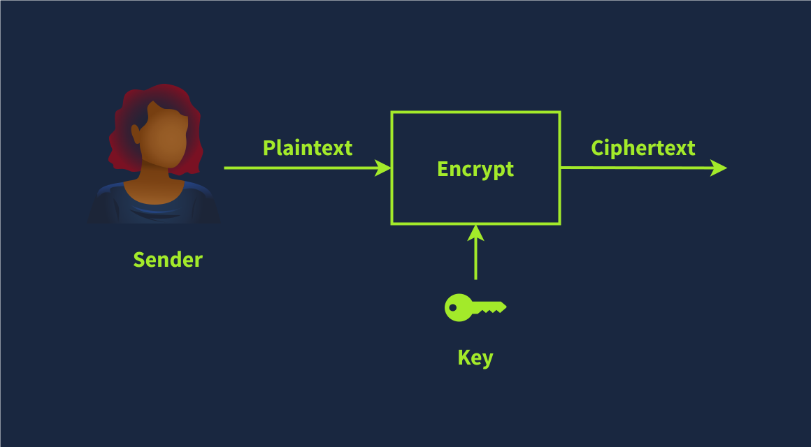
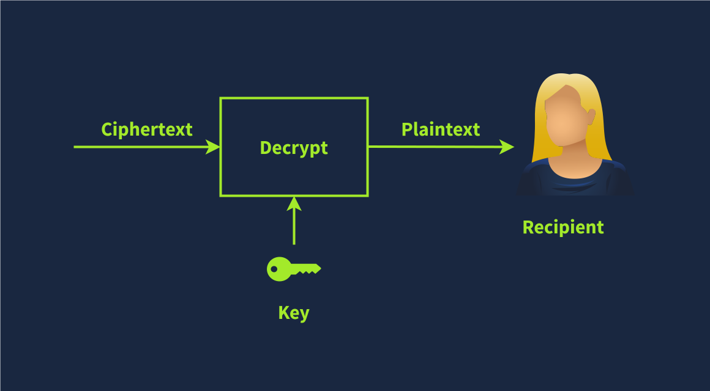

# Cryptography

Explore various symmetric and asymmetric encryption algorithms. Discover the usage of hashing algorithms in everyday systems.

## introduction

The terms are listed below:

- **Plaintext** is the original, readable message or data before it’s encrypted. It can be a document, an image, a multimedia file, or any other binary data.
- **Ciphertext** is the scrambled, unreadable version of the message after encryption. Ideally, we cannot get any information about the original plaintext except its approximate size.
- **Cipher** is an **algorithm** or **method** to convert plaintext into ciphertext and back again. A cipher is usually developed by a mathematician.
- **Key** is a string of bits the cipher uses to encrypt or decrypt data. In general, the used cipher is public knowledge; however, the key must remain secret unless it is the public key in asymmetric encryption. We will visit asymmetric encryption in a later task.
- **Encryption** is the process of converting plaintext into ciphertext using a cipher and a key. Unlike the key, the choice of the cipher is disclosed.
- **Decryption** is the reverse process of encryption, converting ciphertext back into plaintext using a cipher and a key. Although the cipher would be public knowledge, recovering the plaintext without knowledge of the key should be impossible (infeasible).

The **plaintext** is passed through the **encryption function** along with a proper **key**; the **encryption function** returns a **ciphertext**. The **encryption function** is part of the **cipher**; a **cipher** is an **algorithm** to convert a plaintext into a ciphertext and vice versa.

To recover the plaintext, we must pass the ciphertext along with the proper key via the d**ecryption function**, which would give us the original plaintext. This is shown in the illustration below.

**Symmetric Encryption**

**Symmetric encryption**, also known as **symmetric cryptography**, uses the same key to encrypt and decrypt the data, as shown in the figure below. Keeping the key secret is a must; it is also called **private key cryptography**. Furthermore, communicating the key to the intended parties can be challenging as it requires a secure communication channel. Maintaining the secrecy of the key can be a significant challenge, especially if there are many recipients. The problem becomes more severe in the presence of a powerful adversary.

**Advanced Encryption Standard (AES)** is a symmetric block encryption algorithm. It can use cryptographic keys of sizes 128, 192, and 256 bits.

## Asymmetric Encryption

Unlike symmetric encryption, which uses the same key for encryption and decryption, **asymmetric encryption** uses a pair of keys, one to encrypt and the other to decrypt, as shown in the illustration below. To protect confidentiality, asymmetric encryption or **asymmetric cryptography** encrypts the data using the public key; hence, it is also called **public key cryptography**.

Examples are RSA, Diffie-Hellman, and Elliptic Curve cryptography (ECC). The two keys involved in the process are referred to as a **public key** and a **private key**. Data encrypted with the public key can be decrypted with the private key. Your private key needs to be kept private, hence the name.

- **RSA** is a method for encrypting data using two keys: one to lock (encrypt) and another to unlock (decrypt) it, relying on the difficulty of factoring large number.
- **ECC** is a way to encrypt data using smaller keys while still providing strong security. It is based on the math of elliptic curves.

Asymmetric encryption tends to be slower, and many asymmetric encryption ciphers use larger keys than symmetric encryption. For example, RSA uses 2048-bit, 3072-bit, and 4096-bit keys; 2048-bit is the recommended minimum key size. Diffie-Hellman also has a recommended minimum key size of 2048 bits but uses 3072-bit and 4096-bit keys for enhanced security. On the other hand, ECC can achieve equivalent security with shorter keys. For example, with a 256-bit key, ECC provides a level of security comparable to a 3072-bit RSA key.

Asymmetric encryption is based on a particular group of mathematical problems that are easy to compute in one direction but extremely difficult to reverse. In this context, extremely difficult means practically infeasible. For example, we can rely on a mathematical problem that would take a very long time, for example, millions of years, to solve using today’s technology.

### RSA

RSA is a public-key encryption algorithm that enables secure data transmission over insecure channels. With an insecure channel, we expect adversaries to eavesdrop on it.

RSA is a method for encrypting data using two keys: one to lock (encrypt) and another to unlock (decrypt) it, relying on the difficulty of factoring large number.

RSA is based on the mathematically difficult problem of factoring a large number. Multiplying two large prime numbers is a straightforward operation; however, finding the factors of a huge number takes much more computing power.

In the following simplified numerical example, we see the RSA algorithm in action:

1. Bob chooses two prime numbers: p = 157 and q = 199. He calculates n = p × q = 31243.
2. With ϕ(n) = n − p − q + 1 = 31243 − 157 − 199 + 1 = 30888, Bob selects e = 163 such that e is relatively prime to ϕ(n); moreover, he selects d = 379, where e × d = 1 mod ϕ(n), i.e., e × d = 163 × 379 = 61777 and 61777 mod 30888 = 1. The public key is (n,e), i.e., (31243,163) and the private key is $(n,d), i.e., (31243,379).
3. Let’s say that the value they want to encrypt is x = 13, then Alice would calculate and send y = xe mod n = 13163 mod 31243 = 16341.
4. Bob will decrypt the received value by calculating x = yd mod n = 16341379 mod 31243 = 13. This way, Bob recovers the value that Alice sent.

The proof that the above algorithm works can be found in [modular arithmetic](https://www.britannica.com/science/modular-arithmetic) . It is worth repeating that in this example, we picked a three-digit prime number, while in an actual application, p and q would be at least a 300-digit prime number each.

## algorithms

### Basic Math

**XOR Operation**

**XOR**, short for “**exclusive OR**”, is a logical operation in binary arithmetic that plays a crucial role in various computing and cryptographic applications. In binary, XOR compares two bits and returns 1 if the bits are different and 0 if they are the same, as shown in the truth table below. This operation is often represented by the symbol ⊕ or ^.

**XOR** Is a binary operation that is commonly used for encryption and decryption of data. XOR operates on binary data (bits) and is based on the principles of Boolean algebra. The operation involves two bits. The result of the operation is "1" if the two bits are different, and "0" if they are the same.

| A | B | A ⊕ B |
|:--:|:--:|:--:|
| 0  | 0  | 0  |
| 0  | 1  | 1  |
| 1  | 0  | 1  |
| 1  | 1  | 0  |

XOR has several interesting properties that make it useful in cryptography and error detection. One key property is that applying XOR to a value with itself results in 0, and applying XOR to any value with 0 leaves it unchanged. This means A ⊕ A = 0, and A ⊕ 0 = A for any binary value A. Additionally, XOR is commutative, i.e., A ⊕ B = B ⊕ A. And it is associative, i.e., (A ⊕ B) ⊕ C = A ⊕ (B ⊕ C).

Let’s see how we can make use of the above in cryptography. We will demonstrate how XOR can be used as a basic symmetric encryption algorithm. Consider the binary values P and K, where P is the plaintext, and K is the secret key. The ciphertext is C = P ⊕ K.

Now, if we know C and K, we can recover P. We start with C ⊕ K = (P ⊕ K) ⊕ K. But we know that (P ⊕ K) ⊕ K = P ⊕ (K ⊕ K) because XOR is associative. Furthermore, we know that K ⊕ K = 0; consequently, (P ⊕ K) ⊕ K = P ⊕ (K ⊕ K) = P ⊕ 0 = P. In other words, XOR served as a simple symmetric encryption algorithm. In practice, it is more complicated as we need a secret key as long as the plaintext.

**Modulo Operation**

Another mathematical operation we often encounter in cryptography is the modulo operator, commonly written as % or as mod. The modulo operator, X%Y, is the **remainder** when X is divided by Y. 

