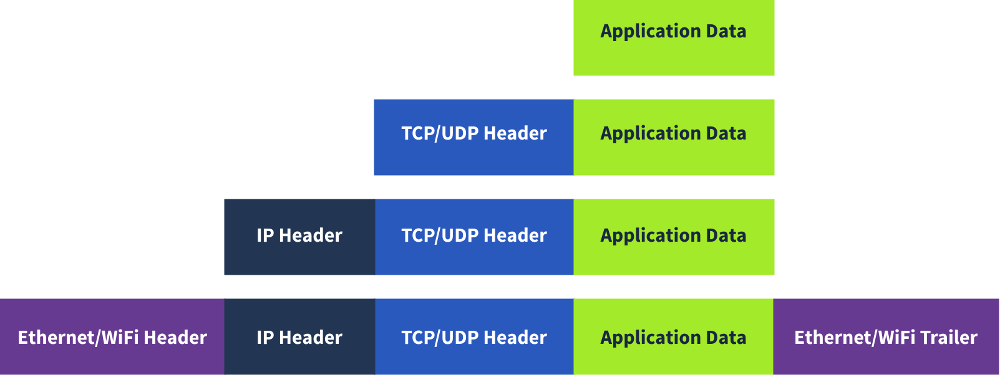

---
title: "networks advancement"
quote: tryhackme
categories:
  - 技术
  - 教程
tags: [Markdown, network]
description: Network Fundamentals
draft: false
sidebar: false
outline: deep
--- 

# NetworkPro

## Networking Concepts

**Objectives**

- ISO OSI network model
- IP addresses, subnets, and routing
- TCP, UDP, and port numbers
- How to connect to an open TCP port from the command line

### OSI Model

The **OSI (Open Systems Interconnection)** model is a conceptual model developed by the International Organization for Standardization (ISO) that describes how communications should occur in a computer network. In other words, the OSI model defines a framework for computer network communications. Although this model is **theoretical**, it is vital to learn and understand as it helps grasp networking concepts on a deeper level. The OSI model is composed of seven layers:

| Layer Number | Layer Name | Main Function | Example Protocols and Standards |
| :---: | :---: | :---: | :---: |
| Layer 7 | Application layer | Providing services and interfaces to applications | HTTP, FTP, DNS, POP3, SMTP, IMAP |
| Layer 6 | Presentation layer | Data encoding, encryption, and compression | Unicode, MIME, JPEG, PNG, MPEG |
| Layer 5 | Session layer | Establishing, maintaining, and synchronising sessions | NFS, RPC |
| Layer 4 | Transport layer | End - to - end communication and data segmentation | UDP, TCP |
| Layer 3 | Network layer | Logical addressing and routing between networks | IP, ICMP, IPSec |
| Layer 2 | Data link layer | Reliable data transfer between adjacent nodes | Ethernet (802.3), WiFi (802.11) |
| Layer 1 | Physical layer | Physical data transmission media | Electrical, optical, and wireless signals | 

### TCP/IP Model

TCP/IP stands for Transmission Control Protocol/Internet Protocol and was developed in the 1970s by the Department of Defense (DoD). I hear you ask why DoD would create such a model. One of the strengths of this model is that it allows a network to continue to function as parts of it are out of service, for instance, due to a military attack. This capability is possible in part due to the design of the routing protocols to adapt as the network topology changes.

In our presentation of the ISO OSI model, we went from bottom to top, from layer 1 to layer 7. In this task, let’s look at things from a different perspective, from top to bottom. From top to bottom, we have:

- Application Layer: The OSI model application, presentation and session layers, i.e., layers 5, 6, and 7, are grouped into the application layer in the TCP/IP model.
- Transport Layer: This is layer 4.
- Internet Layer: This is layer 3. The OSI model’s network layer is called the Internet layer in the TCP/IP model.
- Link Layer: This is layer 2.

### IP Addresses and Subnets

At the risk of oversimplifying things, the 0 and 255 are reserved for the network and broadcast addresses, respectively. In other words, 192.168.1.0 is the network address, while 192.168.1.255 is the broadcast address. Sending to the broadcast address targets all the hosts on the network. With simple math, you can conclude that we cannot have more than 4 billion unique IPv4 addresses. If you are curious about the math, it is approximately 232 because we have 32 bits. This number is approximate because we didn’t consider network and broadcast addresses.

**Private Addresses**

RFC 1918 defines the following three ranges of private IP addresses:

- 10.0.0.0 - 10.255.255.255 (10/8)
- 172.16.0.0 - 172.31.255.255 (172.16/12)
- 192.168.0.0 - 192.168.255.255 (192.168/16)

### UDP and TCP

The IP protocol allows us to reach a destination host on the network; the host is identified by its IP address. We need protocols that would enable processes on networked hosts to communicate with each other. There are two transport protocols to achieve that: UDP and TCP.

**UDP**

**UDP (User Datagram Protocol)** allows us to reach a specific process on this target host. UDP is a simple connectionless protocol that operates at the transport layer, i.e., layer 4. Being connectionless means that it does not need to establish a connection. UDP does not even provide a mechanism to know that the packet has been delivered.

An IP address identifies the host; we need a mechanism to determine the sending and receiving process. This can be achieved by using port numbers. A port number uses two octets; consequently, it ranges between 1 and 65535; port 0 is reserved. (The number 65535 is calculated by the expression 216 − 1.)

**TCP**

**TCP (Transmission Control Protocol)** is a connection-oriented transport protocol. It uses various mechanisms to ensure reliable data delivery sent by the different processes on the networked hosts. Like UDP, it is a layer 4 protocol. Being connection-oriented, it requires the establishment of a TCP connection before any data can be sent.

In TCP, each data octet has a sequence number; this makes it easy for the receiver to identify lost or duplicated packets. The receiver, on the other hand, acknowledges the reception of data with an acknowledgement number specifying the last received octet.

A TCP connection is established using what’s called a three-way handshake. Two flags are used: SYN (Synchronise) and ACK (Acknowledgment). The packets are sent as follows:

1. SYN Packet: The client initiates the connection by sending a SYN packet to the server. This packet contains the client’s randomly chosen initial sequence number.
2. SYN-ACK Packet: The server responds to the SYN packet with a SYN-ACK packet, which adds the initial sequence number randomly chosen by the server.
3. ACK Packet: The three-way handshake is completed as the client sends an ACK packet to acknowledge the reception of the SYN-ACK packet.

### Encapsulation

In this context, encapsulation refers to the process of every layer adding a header (and sometimes a trailer) to the received unit of data and sending the “encapsulated” unit to the layer below.

**Encapsulation** is an essential concept as it allows each layer to focus on its intended function. In the image below, we have the following four steps:

- **Application data:** It all starts when the user inputs the data they want to send into the application. For example, you write an email or an instant message and hit the send button. The application formats this data and starts sending it according to the application protocol used, using the layer below it, the transport layer.
- **Transport protocol segment or datagram:** The transport layer, such as TCP or UDP, adds the proper header information and creates the **TCP segment** (or **UDP datagram**). This segment is sent to the layer below it, the network layer.
- **Network packet:** The network layer, i.e. the Internet layer, adds an IP header to the received TCP segment or UDP datagram. Then, this IP packet is sent to the layer below it, the data link layer.
- **Data link frame:** The Ethernet or WiFi receives the IP packet and adds the proper header and trailer, creating a **frame**.

We start with application data. At the transport layer, we add a TCP or UDP header to create a TCP segment or UDP datagram. Again, at the network layer, we add the proper IP header to get an IP packet that can be routed over the Internet. Finally, we add the appropriate header and trailer to get a WiFi or Ethernet frame at the link layer.

The process has to be reversed on the receiving end until the application data is extracted.

**The Life of a Packet**

Based on what we have studied so far, we can explain a simplified version of the packet’s life. Let’s consider the scenario where you search for a room on TryHackMe.

1. On the TryHackMe search page, you enter your search query and hit enter.
2. Your web browser, using HTTPS, prepares an HTTP request and pushes it to the layer below it, the transport layer.
3. The TCP layer needs to establish a connection via a three-way handshake between your browser and the TryHackMe web server. After establishing the TCP connection, it can send the HTTP request containing the search query. Each TCP segment created is sent to the layer below it, the Internet layer.
4. The IP layer adds the source IP address, i.e., your computer, and the destination IP address, i.e., the IP address of the TryHackMe web server. For this packet to reach the router, your laptop delivers it to the layer below it, the link layer.
5. Depending on the protocol, The link layer adds the proper link layer header and trailer, and the packet is sent to the router.
6. The router removes the link layer header and trailer, inspects the IP destination, among other fields, and routes the packet to the proper link. Each router repeats this process until it reaches the router of the target server.

The steps will then be reversed as the packet reaches the router of the destination network.

### Telnet

The **TELNET (Teletype Network) protocol** is a network protocol for remote terminal connection. In simpler words, **telnet**, a TELNET client, allows you to connect to and communicate with a remote system and issue text commands. Although initially it was used for remote administration, we can use **telnet** to connect to any server listening on a TCP port number.

**工作原理**

基于客户端 / 服务器模式 。本地计算机运行 Telnet 客户端程序，向目标计算机（运行 Telnet 服务器程序 ）发起 TCP 连接（默认端口 23 ）。连接建立后，用户在本地输入的命令经客户端传输给服务器，服务器执行命令并将结果返回给客户端显示 ，就像在本地操作目标计算机一样。

**优缺点**

- 优点：简单易用，几乎所有计算机操作系统都支持；连接速度快，操作界面响应灵敏，适合快速命令行操作 。
- 缺点：所有登录凭证（用户名、密码等 ）和传输数据都是明文形式，在网络传输过程中容易被截取，安全性差，在不安全网络（如公共 Wi-Fi ）中易遭受中间人攻击 。

随着网络安全需求提升，更安全的 SSH（Secure Shell ）协议逐渐取代 Telnet 成为远程登录首选 ，SSH 支持用户名、密码、密钥等多重身份验证，且数据加密传输 。 但在一些对安全性要求不高的内部网络或特定测试场景中，Telnet 仍有一定应用 。

## Networking Essentials

Explore networking protocols from automatic configuration to routing packets to the destination.

路由（Routing）通常指的是在网络中确定数据包从源地址到目标地址的传输路径的过程。

更具体地说，它可以指：

**网络路由：** 在计算机网络中，路由器负责根据目标 IP 地址选择最佳路径，将数据包转发到下一个网络节点，最终到达目的地。 路由协议（如 RIP、OSPF、BGP）用于路由器之间交换路由信息，构建路由表，以便做出最佳的转发决策。

**Web 应用程序路由：** 在 Web 应用程序中，路由指的是根据用户请求的 URL，将请求映射到相应的处理程序（例如，控制器方法或视图）。 路由机制使得 Web 应用程序可以根据不同的 URL 提供不同的内容或执行不同的操作。 常见的 Web 框架（如 Django、Flask、Rails）都提供了强大的路由功能。

简单来说，路由就是**确定数据传输路径的过程**，无论是在计算机网络中还是在 Web 应用程序中。 它可以确保数据能够高效、准确地到达目的地。

**Objectives**

- Dynamic Host Configuration Protocol (DHCP)
- Address Resolution Protocol (ARP)
- Network Address Translation (NAT)
- Internet Control Message Protocol (ICMP)
  - Ping
  - Traceroute

### DHCP: Give Me My Network Settings

