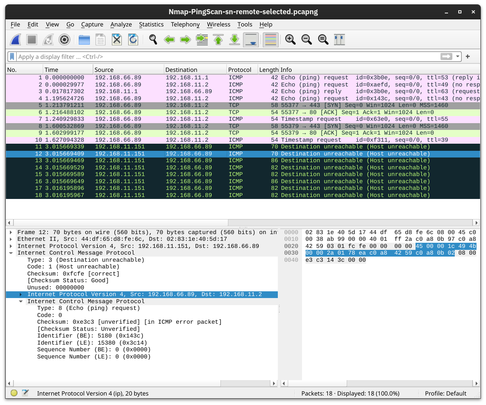

# tools

---

## Gobuster

Gobuster 是一个用 Go 语言编写的命令行工具，主要用于目录和文件的暴力破解以及 DNS 子域名的暴力破解。它非常适合用于渗透测试和安全评估，帮助发现隐藏的目录、文件和子域名。

Gobuster 的主要功能包括：
- 目录和文件暴力破解：通过字典文件尝试访问目标服务器上的隐藏目录和文件。
- DNS 子域名暴力破解：通过字典文件尝试发现目标域名的子域名。
- S3 存储桶暴力破解：尝试发现 AWS S3 存储桶。

Gobuster 的一些常用选项包括：
- `-u`：指定目标 URL。
- `-w`：指定字典文件路径。
- `-t`：指定并发线程数。
- `-o`：指定输出文件路径。

示例用法：
```sh
gobuster dir -u http://example.com -w /path/to/wordlist.txt -t 50 -o output.txt
```

这个命令会使用 `/path/to/wordlist.txt` 中的单词列表对 `http://example.com` 进行目录和文件暴力破解，并将结果保存到 `output.txt` 文件中。

---

## Wireshark

Wireshark is an open-source, cross-platform network packet analyser tool capable of sniffing and investigating live traffic and inspecting packet captures (PCAP). It is commonly used as one of the best packet analysis tools.

**Packet capture (PCAP)** is a networking practice involving the interception of data packets travelling over a network. Once the packets are captured, they can be stored by IT teams for further analysis. The inspection of these packets allows IT teams to identify issues and solve network problems affecting daily operations.

### Packet Dissection

Packet dissection is also known as protocol dissection, which investigates packet details by decoding available protocols and fields. Wireshark supports a long list of protocols for dissection, and you can also write your dissection scripts. You can find more details on dissection [here](https://github.com/boundary/wireshark/blob/master/doc/README.dissector).

**Note:** This section covers how Wireshark uses OSI layers to break down packets and how to use these layers for analysis.


<span style="font-size: 23px;">**Packet Details**</span>

You can click on a packet in the packet list pane to open its details (double-click will open details in a new window). Packets consist of 5 to 7 layers based on the OSI model.


We can see seven distinct layers to the packet: frame/packet, source [MAC], source [IP], protocol, protocol errors, application protocol, and application data. Below we will go over the layers in more detail.

**The Frame (Layer 1):** This will show you what frame/packet you are looking at and details specific to the Physical layer of the OSI model.

.png>)

**Source [MAC] (Layer 2):** This will show you the source and destination MAC Addresses; from the Data Link layer of the OSI model.

![Source [MAC] (Layer 2)](<assets/Source [MAC] (Layer 2).png>)

**Source [IP] (Layer 3):** This will show you the source and destination IPv4 Addresses; from the Network layer of the OSI model.

![Source [IP] (Layer 3)](<assets/Source [IP] (Layer 3).png>)

**Protocol (Layer 4):** This will show you details of the protocol used (UDP/TCP) and source and destination ports; from the Transport layer of the OSI model.

.png>)

**Protocol Errors:** This continuation of the 4th layer shows specific segments from TCP that needed to be reassembled.


**Application Protocol (Layer 5):** This will show details specific to the protocol used, such as HTTP, FTP,  and SMB. From the Application layer of the OSI model.

.png>)

**Application Data:** This extension of the 5th layer can show the application-specific data.


### Packet Nivagation

<span style="font-size: 23px;">**Export Objects (Files)**</span>

Wireshark can extract files transferred through the wire. For a security analyst, it is vital to discover shared files and save them for further investigation. Exporting objects are available only for selected protocol's streams (DICOM, HTTP, IMF, SMB and TFTP).


<span style="font-size: 23px;">**Expert Info**</span>

Wireshark also detects specific states of protocols to help analysts easily spot possible anomalies and problems. Note that these are only suggestions, and there is always a chance of having false positives/negatives. Expert info can provide a group of categories in three different severities. Details are shown in the table below.

<div align=left></div>

### Packet Filtering  

Wireshark has a powerful filter engine that helps analysts to narrow down the traffic and focus on the event of interest. Wireshark has two types of filtering approaches: capture and display filters. Capture filters are used for "**capturing**" only the packets valid for the used filter. Display filters are used for "**viewing**" the packets valid for the used filter. We will discuss these filters' differences and advanced usage in the next room. Now let's focus on basic usage of the display filters, which will help analysts in the first place.

Filters are specific queries designed for protocols available in Wireshark's official protocol reference. While the filters are only the option to investigate the event of interest, there are two different ways to filter traffic and remove the noise from the capture file. The first one uses queries, and the second uses the right-click menu. Wireshark provides a powerful GUI, and <u>there is a golden rule for analysts who don't want to write queries for basic tasks</u>: "**If you can click on it, you can filter and copy it**"


<span style="font-size: 23px;">**Follow Stream**</span>

Wireshark displays everything in packet portion size. However, it is possible to reconstruct the streams and view the raw traffic as it is presented at the application level. Following the protocol, streams help analysts recreate the application-level data and understand the event of interest. It is also possible to view the unencrypted protocol data like usernames, passwords and other transferred data.

You can use the"right-click menu" or  "`Analyse --> Follow TCP/UDP/HTTP Stream`" menu to follow traffic streams. Streams are shown in a separate dialogue box; packets originating from the server are highlighted with blue, and those originating from the client are highlighted with red.


## Tcpdump

The Tcpdump tool and its `libpcap` library are written in C and C++ and were released for Unix-like systems in the late 1980s or early 1990s. Consequently, they are very stable and offer optimal speed. The libpcap library is the foundation for various other networking tools today. Moreover, it was ported to MS Windows as winpcap.

### Basic Packet Capture

You can run `tcpdump` without providing any arguments; however, this is only useful to test that you have it installed! In any real scenario, we must be specific about what to listen to, where to write, and how to display the packets.

| Command              | Explanation                                                |
|----------------------|------------------------------------------------------------|
| `tcpdump -i INTERFACE`| Captures packets on a specific network interface           |
| `tcpdump -w FILE`    | Writes captured packets to a file                          |
| `tcpdump -r FILE`    | Reads captured packets from a file                         |
| `tcpdump -c COUNT`   | Captures a specific number of packets                      |
| `tcpdump -n`         | Don't resolve IP addresses, i.e. not display hostname             |
| `tcpdump -nn`        | Don't resolve IP addresses and don't resolve protocol numbers |
| `tcpdump -v`         | Verbose display; verbosity can be increased with `-vv` and `-vvv` |

Consider the following examples:

- `tcpdump -i eth0 -c 50 -v` captures and displays 50 packets by listening on the `eth0` interface, which is a wired Ethernet, and displays them verbosely.
- `tcpdump -i wlo1 -w data.pcap` captures packets by listening on the `wlo1` interface (the WiFi interface) and writes the packets to `data.pcap`. It will continue till the user interrupts the capture by pressing CTRL-C.
- `tcpdump -i any -nn` captures packets on all interfaces and displays them on screen without domain name or protocol resolution.

### Filtering Expressions

<span style="font-size: 23px;">**Logical Operators**</span>
Three logical operators that can be handy:

- `and`: Captures packets where both conditions are true. For example, `tcpdump host 1.1.1.1 and tcp` captures `tcp` traffic with `host 1.1.1.1`.
- `or`: Captures packets when either one of the conditions is true. For instance, `tcpdump udp or icmp` captures UDP or ICMP traffic.
- `not`: Captures packets when the condition is not true. For example, tcpdump not tcp captures all packets except TCP segments; we expect to find `UDP`, `ICMP`, and `ARP` packets among the results.

| Command                                        | Explanation                                              |
|------------------------------------------------|----------------------------------------------------------|
| `tcpdump host IP` 或 `tcpdump host HOSTNAME`    | Filters packets by IP address or hostname                |
| `tcpdump src host IP` 或                       | Filters packets by a specific source host                |
| `tcpdump dst host IP`                          | Filters packets by a specific destination host           |
| `tcpdump port PORT_NUMBER`                     | Filters packets by port number                            |
| `tcpdump src port PORT_NUMBER`                 | Filters packets by the specified source port number       |
| `tcpdump dst port PORT_NUMBER`                 | Filters packets by the specified destination port number |
| `tcpdump PROTOCOL`                             | Filters packets by protocol; examples include `ip`, `ip6`, `udp`, `tcp`, and `icmp` | 

Consider the following examples:

- `tcpdump -i any tcp port 22` listens on all interfaces and captures `tcp` packets to or from `port 22`, i.e., SSH traffic.
- `tcpdump -i wlo1 udp port 123` listens on the WiFi network card and filters `udp` traffic to `port 123`, the Network Time Protocol (NTP).
- `tcpdump -i eth0 host example.com and tcp port 443 -w https.pcap` will listen on `eth0`, the wired Ethernet interface and filter traffic exchanged with `example.com` that uses `tcp` and `port 443`. In other words, this command is filtering HTTPS traffic related to `example.com`.

 you can count the lines by piping the output via the `wc` command

```bash
user@TryHackMe$ tcpdump -r traffic.pcap src host 192.168.124.1 -n | wc
reading from file traffic.pcap, link-type EN10MB (Ethernet)
    910   17415  140616
```


<span style="font-size: 23px;">**补充**</span>

```
# What is the IP address of the host that asked for the MAC address of 192.168.124.137?
tcpdump -r traffic.pcap arp
```

端口 53 是 **DNS（域名系统）** 使用的端口。DNS 负责将人类可读的域名（例如 `example.com`）转换为计算机可理解的 IP 地址（例如 `192.168.1.1`），使设备能够正确找到目标服务器。

DNS 主要使用两种协议：
- **UDP 端口 53**：用于标准 DNS 查询（速度快，但没有可靠的传输）。
- **TCP 端口 53**：用于较大的 DNS 响应或区域传输（可靠但速度稍慢）。


```bash
# What hostname (subdomain) appears in the first DNS query?
tcpdump -r traffic.pcap port 53 -n
```
### Advanced Filtering

<span style="font-size: 23px;">**Header Bytes**</span>

The purpose of this section is to be able to filter packets based on the contents of a header byte. Consider the following protocols: ARP, Ethernet, ICMP, IP, TCP, and UDP. These are just a few networking protocols we have studied. How can we tell Tcpdump to filter packets based on the contents of protocol header bytes? (We will not go into details about the headers of each protocol as this is beyond the scope of this room; instead, we will focus on TCP flags.)

Using pcap-filter, Tcpdump allows you to refer to the contents of any byte in the header using the following syntax `proto[expr:size]`, where:

- `proto` refers to the protocol. For example, `arp`, `ether`, `icmp`, `ip`, `ip6`, `tcp`, and `udp` refer to ARP, Ethernet, ICMP, IPv4, IPv6, TCP, and UDP respectively.
- `expr` indicates the byte offset, where `0` refers to the first byte.
- `size` indicates the number of bytes that interest us, which can be one, two, or four. It is optional and is one by default.
To better understand this, consider the following two examples from the pcap-filter manual page (and don’t worry if you find them difficult):

- `ether[0] & 1 != 0` takes the first byte in the Ethernet header and the decimal number 1 (i.e., `0000 0001` in binary) and applies the `&` (the And binary operation). It will return true if the result is not equal to the number 0 (i.e., `0000 0000`). The purpose of this filter is to show packets sent to a multicast address. A multicast Ethernet address is a particular address that identifies a group of devices intended to receive the same data.
- `ip[0] & 0xf != 5` takes the first byte in the IP header and compares it with the hexadecimal number F (i.e., `0000 1111` in binary). It will return true if the result is not equal to the (decimal) number 5 (i.e., `0000 0101` in binary). The purpose of this filter is to catch all IP packets with options.

Don’t worry if you find the above two examples complex. We included them so you know what you can achieve with this; however, fully understanding the above examples is not necessary to finish this task. Instead, we will focus on filtering TCP packets based on the set TCP flags.

You can use `tcp[tcpflags]` to refer to the TCP flags field. The following TCP flags are available to compare with:

- `tcp-syn` TCP SYN (Synchronize)
- `tcp-ack` TCP ACK (Acknowledge)
- `tcp-fin` TCP FIN (Finish)
- `tcp-rst` TCP RST (Reset)
- `tcp-push` TCP Push

Based on the above, we can write:

- `tcpdump "tcp[tcpflags] == tcp-syn"` to capture TCP packets with only the SYN (Synchronize) flag set, while all the other flags are unset.
- `tcpdump "tcp[tcpflags] & tcp-syn != 0"` to capture TCP packets with at least the SYN (Synchronize) flag set.
- `tcpdump "tcp[tcpflags] & (tcp-syn|tcp-ack) != 0"` to capture TCP packets with at least the SYN (Synchronize) or ACK (Acknowledge) flags set.

### Displaying Packets

Tcpdump is a rich program with many options to customize how the packets are printed and displayed. We have selected to cover the following five options:

| Command        | Explanation                                    |
|----------------|------------------------------------------------|
| `tcpdump -q`   | Quick and quite: brief packet information      |
| `tcpdump -e`   | Include MAC addresses                          |
| `tcpdump -A`   | Print packets as ASCII encoding                |
| `tcpdump -xx`  | Display packets in hexadecimal format          |
| `tcpdump -X`   | Show packets in both hexadecimal and ASCII     |

---

## nmap

Nmap (Network Mapper) is a open-source tool used for network discovery and security auditing. It also assists in the exploration of network hosts and services, providing information about open ports, operating systems, and other details.

<span style="font-size: 23px;">**主要功能**</span>

1. **端口扫描**：检测目标主机上开放的端口。
2. **服务识别**：识别运行在开放端口上的服务及其版本。
3. **操作系统检测**：推测目标主机的操作系统类型。
4. **网络拓扑发现**：发现网络中的活跃主机和路由信息。
5. **漏洞扫描**：通过脚本检测已知的漏洞。

<span style="font-size: 23px;">**常用命令示例：**</span>

```bash
# 扫描目标主机的所有开放端口
nmap 192.168.1.1

# 扫描指定端口范围
nmap -p 20-80 192.168.1.1

# 检测服务版本
nmap -sV 192.168.1.1

# 操作系统检测
nmap -O 192.168.1.1

# 使用脚本进行漏洞扫描
nmap --script vuln 192.168.1.1
```

### Ping Scanning

Nmap offers the `-sn` option, i.e., ping scan

`nmap -sn` 是 **Nmap（Network Mapper）** 中的一个常用命令，用于执行 **Ping 扫描（主机发现）**，但不会进一步扫描目标主机的端口或服务。**只探测主机是否存活**，与完整的 Nmap 扫描相比，它是一种更快速、侵入性更小的方式来识别哪些 IP 地址正在使用中。

**作用解释:**
1. **主机发现（Host Discovery）**:

- `-sn` 会发送 **ICMP Echo 请求（Ping）**、**TCP SYN 包到端口 443**、**TCP ACK 包到端口 80** 以及 **[ARP](./network.md#arp) 请求（局域网内）**，根据响应判断主机是否在线。

- 如果目标主机屏蔽了 ICMP，Nmap 会通过其他方式（如 TCP 请求）探测。

2. **跳过端口扫描**:

与默认的 Nmap 扫描不同，`-sn` **不会扫描目标主机的开放端口或服务**，仅确认主机是否存活

<span style="font-size: 23px;">**Scanning a “Local” Network**</span>

When scanning a directly connected network, Nmap starts by sending ARP requests. When a device responds to the ARP request, Nmap labels it with “Host is up”.

```bash
root@tryhackme:~# nmap -sn 192.168.66.0/24
Starting Nmap 7.92 ( https://nmap.org ) at 2024-08-07 13:49 EEST
Nmap scan report for XiaoQiang (192.168.66.1)
Host is up (0.0069s latency).
MAC Address: 44:DF:65:D8:FE:6C (Unknown)
Nmap scan report for S190023240007 (192.168.66.88)
Host is up (0.090s latency).
MAC Address: 7C:DF:A1:D3:8C:5C (Espressif)
Nmap scan report for wlan0 (192.168.66.97)
Host is up (0.20s latency).
MAC Address: 10:D5:61:E2:18:E6 (Tuya Smart)
Nmap scan report for 192.168.66.179
Host is up (0.10s latency).
MAC Address: E4:AA:EC:8F:88:C9 (Tianjin Hualai Technology)
[...]
Nmap done: 256 IP addresses (7 hosts up) scanned in 2.64 seconds
```
<span style="font-size: 23px;">**Scanning a “Remote” Network**</span>

```bash
root@tryhackme:~# nmap -sn 192.168.11.0/24
Starting Nmap 7.92 ( https://nmap.org ) at 2024-08-07 14:05 EEST
Nmap scan report for 192.168.11.1
Host is up (0.018s latency).
Nmap scan report for 192.168.11.151
Host is up (0.0013s latency).
Nmap scan report for 192.168.11.152
Host is up (0.13s latency).
Nmap scan report for 192.168.11.154
Host is up (0.22s latency).
Nmap scan report for 192.168.11.155
Host is up (2.3s latency).
Nmap done: 256 IP addresses (5 hosts up) scanned in 10.67 seconds
```



The Nmap output shows that five hosts are up. But how did Nmap discover this? To learn more, let’s see some sample traffic generated by Nmap. In the screenshot below, we can see the responses from two hosts:

- `192.168.11.1` is live and responded to the ICMP echo (ping) request.
- `192.168.11.2` seems down. Nmap sent two ICMP echo (ping) requests, two ICMP timestamp requests, two TCP packets to port 443 with the SYN flag set, and two TCP packets to port 80 with the ACK flag set. The target didn’t respond to any. We observe several ICMP destination unreachable packets from the `192.168.11.151` router.

### Port Scanning

Earlier, we used `-sn` to discover the live hosts. In this task, we want to discover the network services listening on these live hosts. By network service, we mean any process that is listening for incoming connections on a TCP or UDP port. Common network services include web servers, which usually listen on TCP ports 80 and 443, and DNS servers, which typically listen on UDP (and TCP) port 53.

By design, TCP has 65,535 ports, and the same applies to UDP. How can we determine which ports have a service bound to it? Let’s find out.

| Option | Explanation |
| ------ | ----------- |
| `-sT` | TCP connect scan – complete three-way handshake |
| `-sS` | TCP SYN – only first step of the three-way handshake |
| `-sU` | UDP scan |
| `-F` | Fast mode – scans the 100 most common ports |
| `-p[range]` | Specifies a range of port numbers – `-p-` scans all the ports | 

<span style="font-size: 23px;">**Scanning TCP Ports**</span>

**Connect Scan**

The connect scan can be triggered using `-sT`. It tries to complete the TCP three-way handshake with every target TCP port. If the TCP port turns out to be open and Nmap connects successfully, Nmap will tear down the established connection.

In the screenshot below, our scanning machine has the IP address `192.168.124.148` and the target system has TCP port 22 open and port 23 closed. In the part marked with 1, you can see how the TCP three-way handshake was completed and later torn down with a TCP RST-ACK packet by Nmap. The part marked with 2 shows a connection attempt to a closed port, and the target system responded with a TCP RST-ACK packet.


**SYN Scan (Stealth)**

Unlike the connect scan, which tries to **connect** to the target TCP port, i.e., complete a three-way handshake, the SYN scan only executes the first step: it sends a TCP SYN packet. Consequently, the TCP three-way handshake is never completed. The advantage is that this is expected to lead to fewer logs as the connection is never established, and hence, it is considered a relatively stealthy scan. You can select the SYN scan using the `-sS` flag.

In the screenshot below, we scan the same system with port 22 open. The part marked with 1 shows the listening service replying with a TCP SYN-ACK packet. However, Nmap responded with a TCP RST packet instead of completing the TCP three-way handshake. The part marked with 2 shows a TCP connection attempt to a closed port. In this case, the packet exchange is the same as in the connect scan.


<span style="font-size: 23px;">**Scanning UDP Ports**</span>

Although most services use TCP for communication, many use UDP. Examples include DNS, DHCP, NTP (Network Time Protocol), SNMP (Simple Network Management Protocol), and VoIP (Voice over IP). UDP does not require establishing a connection and tearing it down afterwards. Furthermore, it is very suitable for real-time communication, such as live broadcasts. All these are reasons to consider scanning for and discovering services listening on UDP ports.

Nmap offers the option `-sU` to scan for UDP services. Because UDP is simpler than TCP, we expect the traffic to differ. The screenshot below shows several ICMP destination unreachable (port unreachable) responses as Nmap sends UDP packets to closed UDP ports.


<span style="font-size: 23px;">**Limiting the Target Ports**</span>

Nmap scans the most common 1,000 ports by default. However, this might not be what you are looking for. Therefore, Nmap offers you a few more options.

- `-F` is for Fast mode, which scans the 100 most common ports (instead of the default 1000).
- `-p[range]` allows you to specify a range of ports to scan. For example, `-p10-1024` scans from port 10 to port 1024, while `-p-25` will scan all the ports between 1 and 25. Note that `-p-` scans all the ports and is equivalent to `-p1-65535` and is the best option if you want to be as thorough as possible.

### Version Detection

**Version Detection: Extract More Information**

| Option | Explanation |
| ------ | ----------- |
| `-O`  | OS detection |
| `-sV` | Service and version detection |
| `-A`  | OS detection, version detection, and other additions |
| `-Pn` | Scan hosts that appear to be down | 

<span style="font-size: 23px;">**OS Detection**</span>

You can enable OS detection by adding the `-O` option. As the name implies, the OS detection option triggers Nmap to rely on various indicators to make an educated guess about the target OS. In this case, it is detecting the target has Linux 4.x or 5.x running. That’s actually true. However, there is no perfectly accurate OS detector. The statement that it is between 4.15 and 5.8 is very close as the target host’s OS is 5.15.

```bash
root@tryhackme:~# nmap -sS -O 192.168.124.211 
Starting Nmap 7.94SVN ( https://nmap.org ) at 2024-08-13 13:37 EEST
Nmap scan report for ubuntu22lts-vm (192.168.124.211)
Host is up (0.00043s latency).
Not shown: 999 closed tcp ports (reset)
PORT   STATE SERVICE
22/tcp open  ssh
MAC Address: 52:54:00:54:FA:4E (QEMU virtual NIC)
Device type: general purpose
Running: Linux 4.X|5.X
OS CPE: cpe:/o:linux:linux_kernel:4 cpe:/o:linux:linux_kernel:5
OS details: Linux 4.15 - 5.8
Network Distance: 1 hop

OS detection performed. Please report any incorrect results at https://nmap.org/submit/ .
Nmap done: 1 IP address (1 host up) scanned in 1.44 seconds
```

<span style="font-size: 23px;">**Service and Version Detection**</span>

You discovered several open ports and want to know what services are listening on them. `-sV` enables version detection. This is very convenient for gathering more information about your target with fewer keystrokes. The terminal output below shows an additional column called “VERSION”, indicating the detected SSH server version.

```bash
root@tryhackme:~# nmap -sS -sV 192.168.124.211
Starting Nmap 7.94SVN ( https://nmap.org ) at 2024-08-13 13:33 EEST
Nmap scan report for ubuntu22lts-vm (192.168.124.211)
Host is up (0.000046s latency).
Not shown: 999 closed tcp ports (reset)
PORT   STATE SERVICE VERSION
22/tcp open  ssh     OpenSSH 8.9p1 Ubuntu 3ubuntu0.10 (Ubuntu Linux; protocol 2.0)
MAC Address: 52:54:00:54:FA:4E (QEMU virtual NIC)
Service Info: OS: Linux; CPE: cpe:/o:linux:linux_kernel

Service detection performed. Please report any incorrect results at https://nmap.org/submit/ .
Nmap done: 1 IP address (1 host up) scanned in 0.25
```
What if you can have both `-O`, `-sV` and some more in one option? That would be `-A`. This option enables OS detection, version scanning, and traceroute, among other things.

<span style="font-size: 23px;">**Forcing the Scan**</span>

When we run our port scan, such as using `-sS`, there is a possibility that the target host does not reply during the host discovery phase (e.g. a host doesn’t reply to ICMP requests). Consequently, Nmap will mark this host as down and won’t launch a port scan against it. We can ask Nmap to treat all hosts as online and port scan every host, including those that didn’t respond during the host discovery phase. This choice can be triggered by adding the `-Pn` option.

### Timing

How Fast is **Fast**

Nmap provides various options to control the scan speed and timing.

| Option | Explanation |
| ------ | ----------- |
| `-T<0-5>` | Timing template – paranoid (0), sneaky (1), polite (2), normal (3), aggressive (4), and insane (5) |
| `--min-parallelism <numprobes>` and `--max-parallelism <numprobes>` | Minimum and maximum number of parallel probes |
| `--min-rate <number>` and `--max-rate <number>` | Minimum and maximum rate (packets/second) |
| `--host-timeout` | Maximum amount of time to wait for a target host | 

### Output

**Output: Controlling What You See**

<span style="font-size: 23px;">**Verbosity and Debugging**</span>

In some cases, the scan takes a very long time to finish or to produce any output that will be displayed on the screen. Furthermore, sometimes you might be interested in more real-time information about the scan progress. The best way to get more updates about what’s happening is to enable verbose output by adding `-v`. 

Most likely, the `-v` option is more than enough for verbose output; however, if you are still unsatisfied, you can increase the verbosity level by adding another “v” such as `-vv` or even `-vvvv`. You can also specify the verbosity level directly, for example, `-v2` and `-v4`. You can even increase the verbosity level by pressing “v” after the scan already started.

If all this verbosity does not satisfy your needs, you must consider the `-d` for debugging-level output. Similarly, you can increase the debugging level by adding one or more “d” or by specifying the debugging level directly. The maximum level is `-d9`; before choosing that, make sure you are ready for thousands of information and debugging lines.

<span style="font-size: 23px;">**Saving Scan Report**</span>

In many cases, we would need to save the scan results. Nmap gives us various formats. The three most useful are normal (human-friendly) output, XML output, and grepable output, in reference to the `grep` command. You can select the scan report format as follows:

- `-oN <filename>` - Normal output
- `-oX <filename>` - XML output
- `-oG <filename>` - grep-able output (useful for `grep` and `awk`)
- `-oA <basename>` - Output in all major formats

In the terminal below, we can see an example of using the `-oA` option. It resulted in three reports with the extensions `nmap`, `xml`, and `gnmap` for normal, XML, and grep-able output.

```bash
root@tryhackme:~# nmap -sS 192.168.139.1 -oA gateway
Starting Nmap 7.92 ( https://nmap.org ) at 2024-08-13 19:35 EEST
Nmap scan report for g5000 (192.168.139.1)
Host is up (0.0000070s latency).
Not shown: 999 closed tcp ports (reset)
PORT    STATE SERVICE
902/tcp open  iss-realsecure

Nmap done: 1 IP address (1 host up) scanned in 0.13 seconds

# ls
gateway.gnmap  gateway.nmap  gateway.xml
```

## John the Ripper

John the Ripper is a free and open-source password-cracking tool. It can crack passwords stored in various formats, including hashes, passwords, and encrypted private keys. It can be used to test passwords' security and recover lost passwords.

John the Ripper is a well-known, well-loved, and versatile hash-cracking tool. It combines a fast cracking speed with an extraordinary range of compatible hash types.

### Setting Up Your System

<span style="font-size: 23px;">**installation**</span>

[official installation guide](https://github.com/openwall/john/blob/bleeding-jumbo/doc/INSTALL) 

[ Openwall Wiki](https://www.openwall.com/john/)

<span style="font-size: 23px;">**Wordlists**</span>

As we mentioned earlier, to use a dictionary attack against hashes, you need a list of words to hash and compare; unsurprisingly, this is called a wordlist. There are many different wordlists out there, and a good collection can be found in the [SecLists](https://github.com/danielmiessler/SecLists) repository. There are a few places you can look for wordlists for attacking the system of choice.

**RockYou**

The infamous `rockyou.txt` wordlis,a very large common password wordlist obtained from a data breach on a website called rockyou.com in 2009. If you are not using any of the above distributions, you can get the `rockyou.txt` wordlist from the [SecLists](https://github.com/danielmiessler/SecLists) repository under the `/Passwords/Leaked-Databases` subsection. You may need to extract it from the .tar.gz format using `tar xvzf rockyou.txt.tar.gz`.

### Cracking Basic Hashes

<span style="font-size: 23px;">**John Basic Syntax**</span>

`john [options] [file path]`

- `john`: Invokes the John the Ripper program
- `[options]`: Specifies the options you want to use
- `[file path]`: The file containing the hash you’re trying to crack; if it’s in the same directory, you won’t need to name a path, just the file.

<span style="font-size: 23px;">**Automatic Cracking**</span>

John has built-in features to detect what type of hash it’s being given and to select appropriate rules and formats to crack it for you; this isn’t always the best idea as it can be unreliable, but if you can’t identify what hash type you’re working with and want to try cracking it, it can be a good option! To do this, we use the following syntax:

`john --wordlist=[path to wordlist] [path to file]`

- `--wordlist=`: Specifies using wordlist mode, reading from the file that you supply in the provided path
- `[path to wordlist]`: The path to the wordlist you’re using, as described in the previous task

example:
```bash
john --wordlist=/usr/share/wordlists/rockyou.txt hash_to_crack.txt
```

<span style="font-size: 23px;">**Identifying Hashes**</span>

Sometimes, John won’t play nicely with automatically recognising and loading hashes, but that’s okay! We can use other tools to identify the hash and then set John to a specific format. There are multiple ways to do this, such as using an online hash identifier like [this site](https://hashes.com/en/tools/hash_identifier). I like to use a tool called [hash-identifier](https://gitlab.com/kalilinux/packages/hash-identifier/-/tree/kali/master), a Python tool that is super easy to use and will tell you what different types of hashes the one you enter is likely to be, giving you more options if the first one fails.

To use hash-identifier, you can use `wget` or `curl` to download the Python file hash-id.py from its GitLab page. Then, launch it with `python3 hash-id`.py and enter the hash you’re trying to identify. It will give you a list of the most probable formats. These two steps are shown in the terminal below.

```bash
user@TryHackMe$ wget https://gitlab.com/kalilinux/packages/hash-identifier/-/raw/kali/master/hash-id.py
$ python3 hash-id.py

--------------------------------------------------
 HASH: 2e728dd31fb5949bc39cac5a9f066498

Possible Hashs:
[+] MD5
[+] Domain Cached Credentials - MD4(MD4(($pass)).(strtolower($username)))

Least Possible Hashs:
[+] RAdmin v2.x
[+] NTLM
...

```

<span style="font-size: 23px;">**Format-Specific Cracking**</span>

Once you have identified the hash that you’re dealing with, you can tell John to use it while cracking the provided hash using the following syntax:

`john --format=[format] --wordlist=[path to wordlist] [path to file]`

- `--format=`: This is the flag to tell John that you’re giving it a hash of a specific format and to use the following format to crack it
- `[format]`: The format that the hash is in

Example :
```bash
john --format=raw-md5 --wordlist=/usr/share/wordlists/rockyou.txt hash_to_crack.txt
```

**A Note on Formats:**

When you tell John to use formats, if you’re dealing with a standard hash type, e.g. md5 as in the example above, you have to prefix it with `raw-` to tell John you’re just dealing with a standard hash type, though this doesn’t always apply. To check if you need to add the prefix or not, you can list all of John’s formats using `john --list=formats` and either check manually or grep for your hash type using something like `john --list=formats | grep -iF "md5"`.

<span style="font-size: 23px;">Practical  </span>

```bash
# hash4.txt 破解
## step1 查询hash码
user@ip-10-10-131-87:~$ cat hash4.txt
c5a60cc6bbba781c601c5402755ae1044bbf45b78d1183cbf2ca1c865b6c792cf3c6b87791344986c8a832a0f9ca8d0b4afd3d9421a149d57075e1b4e93f90bf
## step2 查询hash类型
┌──(root㉿kali)-[~]
└─# hash-identifier
   #########################################################################
   #     __  __                     __           ______    _____           #
   #    /\ \/\ \                   /\ \         /\__  _\  /\  _ `\         #
   #    \ \ \_\ \     __      ____ \ \ \___     \/_/\ \/  \ \ \/\ \        #
   #     \ \  _  \  /'__`\   / ,__\ \ \  _ `\      \ \ \   \ \ \ \ \       #
   #      \ \ \ \ \/\ \_\ \_/\__, `\ \ \ \ \ \      \_\ \__ \ \ \_\ \      #
   #       \ \_\ \_\ \___ \_\/\____/  \ \_\ \_\     /\_____\ \ \____/      #
   #        \/_/\/_/\/__/\/_/\/___/    \/_/\/_/     \/_____/  \/___/  v1.2 #
   #                                                             By Zion3R #
   #                                                    www.Blackploit.com #
   #                                                   Root@Blackploit.com #
   #########################################################################
--------------------------------------------------
 HASH: c5a60cc6bbba781c601c5402755ae1044bbf45b78d1183cbf2ca1c865b6c792cf3c6b87791344986c8a832a0f9ca8d0b4afd3d9421a149d57075e1b4e93f90bf

Possible Hashs:
[+] SHA-512
[+] Whirlpool

Least Possible Hashs:
[+] SHA-512(HMAC)
[+] Whirlpool(HMAC)
--------------------------------------------------
## step3 选择第一个可能类型 未破解成功 
user@ip-10-10-131-87:~$ john --format=raw-sha512 --wordlist=/usr/share/wordlists/rockyou.txt hash4.txt
Using default input encoding: UTF-8
Loaded 1 password hash (Raw-SHA512 [SHA512 256/256 AVX2 4x])
Warning: poor OpenMP scalability for this hash type, consider --fork=2
Will run 2 OpenMP threads
Note: Passwords longer than 37 [worst case UTF-8] to 111 [ASCII] rejected
Press 'q' or Ctrl-C to abort, 'h' for help, almost any other key for status
0g 0:00:00:05 DONE (2025-05-18 02:07) 0g/s 2427Kp/s 2427Kc/s 2427KC/s !)!#1013..*7¡Vamos!
Session completed. 

## step4 尝试第二个 破解成功
user@ip-10-10-131-87:~$ john --format=whirlpool --wordlist=/usr/share/wordlists/rockyou.txt hash4.txt
Using default input encoding: UTF-8
Loaded 1 password hash (whirlpool [WHIRLPOOL 32/64])
Warning: poor OpenMP scalability for this hash type, consider --fork=2
Will run 2 OpenMP threads
Press 'q' or Ctrl-C to abort, 'h' for help, almost any other key for status
colossal         (?)     
1g 0:00:00:00 DONE (2025-05-18 02:11) 2.083g/s 1416Kp/s 1416Kc/s 1416KC/s cooldog12..chata1994
Use the "--show" option to display all of the cracked passwords reliably
Session completed. 

## tip 查看破解后的密码 
user@ip-10-10-131-87:~$ john --show --format=whirlpool hash4.txt
?:colossal

1 password hash cracked, 0 left
```

### Cracking Windows Authentication Hashes

<span style="font-size: 23px;">**NTHash / NTLM**</span>

**NThash** is the hash format modern Windows operating system machines use to store user and service passwords. It’s also commonly referred to as NTLM, which references the previous version of Windows format for hashing passwords known as **LM**, thus **NT/LM**.

**Windows New Technology LAN Manager (NTLM)** is a suite of security protocols offered by Microsoft to authenticate users’ identity and protect the integrity and confidentiality of their activity.

A bit of history: the NT designation for Windows products originally meant New Technology. It was used starting with Windows NT to denote products not built from the MS-DOS Operating System. Eventually, the “NT” line became the standard Operating System type to be released by Microsoft, and the name was dropped, but it still lives on in the names of some Microsoft technologies.

In Windows, SAM (Security Account Manager) is used to store user account information, including usernames and hashed passwords. You can acquire NTHash/NTLM hashes by dumping the SAM database on a Windows machine, using a tool like Mimikatz, or using the Active Directory database: `NTDS.dit`. You may not have to crack the hash to continue privilege escalation, as you can often conduct a “pass the hash” attack instead, but sometimes, hash cracking is a viable option if there is a weak password policy.

<span style="font-size: 23px;">**Practical**</span>

```bash
user@ip-10-10-131-87:~$ john --format=nt --wordlist=/usr/share/wordlists/rockyou.txt ntlm.txt
Using default input encoding: UTF-8
Loaded 1 password hash (NT [MD4 256/256 AVX2 8x3])
Warning: no OpenMP support for this hash type, consider --fork=2
Note: Passwords longer than 27 rejected
Press 'q' or Ctrl-C to abort, 'h' for help, almost any other key for status
mushroom         (?)     
1g 0:00:00:00 DONE (2025-05-18 02:47) 50.00g/s 153600p/s 153600c/s 153600C/s skater1..dangerous
Use the "--show --format=NT" options to display all of the cracked passwords reliably
Session completed. 
```

### Cracking /etc/shadow Hashes

The `/etc/shadow` file is the file on Linux machines where [password hashes](./cryptography.md#linux-passwords) are stored. It also stores other information, such as the date of last password change and password expiration information. It contains one entry per line for each user or user account of the system. This file is usually only accessible by the root user, so you must have sufficient privileges to access the hashes. However, if you do, there is a chance that you will be able to crack some of the hashes.

<span style="font-size: 23px;">**Unshadowing**</span>

John can be very particular about the formats it needs data in to be able to work with it; for this reason, to crack `/etc/shadow` passwords, you must combine it with the `/etc/passwd` file for John to understand the data it’s being given. To do this, we use a tool built into the John suite of tools called `unshadow`. The basic syntax of `unshadow` is as follows:

`unshadow [path to passwd] [path to shadow]`

- `unshadow`: Invokes the unshadow tool
- `[path to passwd]`: The file that contains the copy of the /etc/passwd file you’ve taken from the target machine
- `[path to shadow]`: The file that contains the copy of the /etc/shadow file you’ve taken from the target machine

Example
```bash
unshadow local_passwd local_shadow > unshadowed.txt
```
**Note on the files**

When using `unshadow`, you can either use the entire `/etc/passwd` and `/etc/shadow` files, assuming you have them available, or you can use the relevant line from each, for example:

**FILE 1 - local_passwd**

Contains the `/etc/passwd` line for the root user:

`root:x:0:0::/root:/bin/bash`

**FILE 2 - local_shadow**

Contains the `/etc/shadow` line for the root user: 

`root:$6$2nwjN454g.dv4HN/$m9Z/r2xVfweYVkrr.v5Ft8Ws3/YYksfNwq96UL1FX0OJjY1L6l.DS3KEVsZ9rOVLB/ldTeEL/OIhJZ4GMFMGA0:18576::::::`

<span style="font-size: 23px;">**Cracking**</span>

We can then feed the output from `unshadow`, in our example use case called `unshadowed.txt`, directly into John. We should not need to specify a mode here as we have made the input specifically for John; however, in some cases, you will need to specify the format as we have done previously using: `--format=sha512crypt`

`john --wordlist=/usr/share/wordlists/rockyou.txt --format=sha512crypt unshadowed.txt`

<span style="font-size: 23px;">**Practical**</span>

```bash
# step1 Unshadowing 
user@ip-10-10-131-87:~/John-the-Ripper-The-Basics/Task06$ ls
etc_hashes.txt  local_passwd  local_shadow
user@ip-10-10-131-87:~/John-the-Ripper-The-Basics/Task06$ cat local_passwd 
root:x:0:0::/root:/bin/bash
user@ip-10-10-131-87:~/John-the-Ripper-The-Basics/Task06$ cat local_shadow 
root:$6$Ha.d5nGupBm29pYr$yugXSk24ZljLTAZZagtGwpSQhb3F2DOJtnHrvk7HI2ma4GsuioHp8sm3LJiRJpKfIf7lZQ29qgtH17Q/JDpYM/:18576::::::
user@ip-10-10-131-87:~/John-the-Ripper-The-Basics/Task06$ unshadow local_passwd local_shadow > unshadowed.txt
user@ip-10-10-131-87:~/John-the-Ripper-The-Basics/Task06$ ls
etc_hashes.txt  local_passwd  local_shadow  unshadowed.txt
user@ip-10-10-131-87:~/John-the-Ripper-The-Basics/Task06$ cat unshadowed.txt 
root:$6$Ha.d5nGupBm29pYr$yugXSk24ZljLTAZZagtGwpSQhb3F2DOJtnHrvk7HI2ma4GsuioHp8sm3LJiRJpKfIf7lZQ29qgtH17Q/JDpYM/:0:0::/root:/bin/bash

# step2 Cracking  
user@ip-10-10-131-87:~/John-the-Ripper-The-Basics/Task06$ cat etc_hashes.txt 
This is everything I managed to recover from the target machine before my computer crashed... See if you can crack the hash so we ca
n at least salvage a password to try and get back in.

root:x:0:0::/root:/bin/bash
root:$6$Ha.d5nGupBm29pYr$yugXSk24ZljLTAZZagtGwpSQhb3F2DOJtnHrvk7HI2ma4GsuioHp8sm3LJiRJpKfIf7lZQ29qgtH17Q/JDpYM/:18576::::::

user@ip-10-10-131-87:~/John-the-Ripper-The-Basics/Task06$ john --wordlist=/usr/share/wordlists/rockyou.txt --format=sha512crypt unshadowed.txt
Using default input encoding: UTF-8
Loaded 1 password hash (sha512crypt, crypt(3) $6$ [SHA512 256/256 AVX2 4x])
Cost 1 (iteration count) is 5000 for all loaded hashes
Will run 2 OpenMP threads
Note: Passwords longer than 26 [worst case UTF-8] to 79 [ASCII] rejected
Press 'q' or Ctrl-C to abort, 'h' for help, almost any other key for status
1234             (root)     
1g 0:00:00:02 DONE (2025-05-18 03:06) 0.4274g/s 547.0p/s 547.0c/s 547.0C/s kucing..poohbear1
Use the "--show" option to display all of the cracked passwords reliably
Session completed. 
```

### Single Crack Mode

So far, we’ve been using John’s wordlist mode to brute-force simple and not-so-simple hashes. But John also has another mode, called the **Single Crack mode**. In this mode, John uses only the information provided in the username to try and work out possible passwords heuristically by slightly changing the letters and numbers contained within the username.

<span style="font-size: 23px;">**Word Mangling**</span>

The best way to explain Single Crack mode and word mangling is to go through an example:

Consider the username “Markus”.

Some possible passwords could be:

- Markus1, Markus2, Markus3 (etc.)
- MArkus, MARkus, MARKus (etc.)
- Markus!, Markus$, Markus* (etc.)

This technique is called **word mangling**. John is building its dictionary based on the information it has been fed and uses a set of rules called “mangling rules,” which define how it can mutate the word it started with to generate a wordlist based on relevant factors for the target you’re trying to crack. This exploits how poor passwords can be based on information about the username or the service they’re logging into.

<span style="font-size: 23px;">**GECOS**</span>

John’s implementation of word mangling also features compatibility with the GECOS field of the UNIX operating system, as well as other UNIX-like operating systems such as Linux. GECOS stands for General Electric Comprehensive Operating System. In the last task, we looked at the entries for both `/etc/shadow` and /etc/passwd. Looking closely, you will notice that the fields are separated by a colon :. The fifth field in the user account record is the GECOS field. It stores general information about the user, such as the user’s full name, office number, and telephone number, among other things. John can take information stored in those records, such as full name and home directory name, to add to the wordlist it generates when cracking `/etc/shadow` hashes with single crack mode.

<span style="font-size: 23px;">**Using Single Crack Mode**</span>

To use single crack mode, we use roughly the same syntax that we’ve used so far; for example, if we wanted to crack the password of the user named “Mike”, using the single mode, we’d use:

`john --single --format=[format] [path to file]`

- `--single`: This flag lets John know you want to use the single hash-cracking mode
- `--format=[format]`: As always, it is vital to identify the proper format.

**Example Usage:**

`john --single --format=raw-sha256 hashes.txt`

**A Note on File Formats in Single Crack Mode:**

If you’re cracking hashes in single crack mode, you need to change the file format that you’re feeding John for it to understand what data to create a wordlist from. You do this by prepending the hash with the username that the hash belongs to, so according to the above example, we would change the file `hashes.txt`

**From** `1efee03cdcb96d90ad48ccc7b8666033`

**To** `mike:1efee03cdcb96d90ad48ccc7b8666033`

<span style="font-size: 23px;">**Q&A**</span>

```bash
user@ip-10-10-84-180:~$ ls
hash07.txt
user@ip-10-10-84-180:~$ cat hash07.txt 
7bf6d9bb82bed1302f331fc6b816aada
user@ip-10-10-84-180:~$ echo -n "joker:" | cat - hash07.txt > hash.txt
user@ip-10-10-84-180:~$ ls
hash.txt  hash07.txt
user@ip-10-10-84-180:~$ cat hash.txt 
joker:7bf6d9bb82bed1302f331fc6b816aada
user@ip-10-10-84-180:~$ john --single --format=raw-md5 hash.txt
Using default input encoding: UTF-8
Loaded 1 password hash (Raw-MD5 [MD5 256/256 AVX2 8x3])
Warning: no OpenMP support for this hash type, consider --fork=2
Note: Passwords longer than 18 [worst case UTF-8] to 55 [ASCII] rejected
Press 'q' or Ctrl-C to abort, 'h' for help, almost any other key for status
Warning: Only 18 candidates buffered for the current salt, minimum 24 needed for performance.
Jok3r            (joker)     
1g 0:00:00:00 DONE (2025-05-18 15:01) 100.0g/s 19600p/s 19600c/s 19600C/s JOKER5..J0ker
Use the "--show --format=Raw-MD5" options to display all of the cracked passwords reliably
Session completed. 
```

### Custom Rules

<span style="font-size: 23px;">**What are Custom Rules?**</span>

As we explored what John can do in Single Crack Mode, you may have some ideas about some good mangling patterns or what patterns your passwords often use that could be replicated with a particular mangling pattern. The good news is that you can define your rules, which John will use to create passwords dynamically. The ability to define such rules is beneficial when you know more information about the password structure of whatever your target is.

<span style="font-size: 23px;">**Common Custom Rules**</span>

Many organisations will require a certain level of password complexity to try and combat dictionary attacks. In other words, when creating a new account or changing your password, if you attempt a password like `polopassword`, it will most likely not work. The reason would be the enforced password complexity. As a result, you may receive a prompt telling you that passwords have to contain at least one character from each of the following:

- Lowercase letter
- Uppercase letter
- Number
- Symbol

Password complexity is good! However, we can exploit the fact that most users will be predictable in the location of these symbols. For the above criteria, many users will use something like the following:

`Polopassword1!`

Consider the password with a capital letter first and a number followed by a symbol at the end. This familiar pattern of the password, appended and prepended by modifiers (such as capital letters or symbols), is a memorable pattern that people use and reuse when creating passwords. This pattern can let us exploit **password complexity predictability**.

Now, this does meet the password complexity requirements; however, as attackers, we can exploit the fact that we know the likely position of these added elements to create dynamic passwords from our wordlists.

<span style="font-size: 23px;">**How to create Custom Rules**</span>

Custom rules are defined in the `john.conf` file. This file can be found in `/opt/john/john.conf` on the TryHackMe Attackbox. It is usually located in `/etc/john/john.conf` if you have installed John using a package manager or built from source with `make`.

Let’s go over the syntax of these custom rules, using the example above as our target pattern. Note that you can define a massive level of granular control in these rules. I suggest looking at the wiki [here](https://www.openwall.com/john/doc/RULES.shtml) to get a full view of the modifiers you can use and more examples of rule implementation.

The first line:

`[List.Rules:THMRules]` is used to define the name of your rule; this is what you will use to call your custom rule a John argument.

We then use a regex style pattern match to define where the word will be modified; again, we will only cover the primary and most common modifiers here:

- `Az`: Takes the word and appends it with the characters you define
- `A0`: Takes the word and prepends it with the characters you define
- `c`: Capitalises the character positionally

These can be used in combination to define where and what in the word you want to modify.

Lastly, we must define what characters should be appended, prepended or otherwise included. We do this by adding character sets in square brackets `[ ]` where they should be used. These follow the modifier patterns inside double quotes `" "`. Here are some common examples:

- `[0-9]`: Will include numbers 0-9
- `[0]`: Will include only the number 0
- `[A-z]`: Will include both upper and lowercase
- `[A-Z]`: Will include only uppercase letters
- `[a-z]`: Will include only lowercase letters

Please note that:

- `[a]`: Will include only `a`
- `[!£$%@]`: Will include the symbols `!`, `£`, `$`, `%`, and `@`

Putting this all together, to generate a wordlist from the rules that would match the example password Polopassword1! (assuming the word polopassword was in our wordlist), we would create a rule entry that looks like this:

`[List.Rules:PoloPassword]`

`cAz"[0-9] [!£$%@]"`

Utilises the following:

- `c`: Capitalises the first letter
- `Az`: Appends to the end of the word
- `[0-9]`: A number in the range 0-9
- `[!£$%@]`: The password is followed by one of these symbols

<span style="font-size: 23px;">**Using Custom Rules**</span>

We could then call this custom rule a John argument using the  `--rule=PoloPassword` flag.

As a full command: `john --wordlist=[path to wordlist] --rule=PoloPassword [path to file]`

As a note, I find it helpful to talk out the patterns if you’re writing a rule; as shown above, the same applies to writing RegEx patterns.

Jumbo John already has an extensive list of custom rules containing modifiers for use in almost all cases. If you get stuck, try looking at those rules [around line 678] if your syntax isn’t working correctly.

### Cracking Password Protected Zip Files

Yes! You read that right. We can use John to crack the password on password-protected Zip files. Again, we’ll use a separate part of the John suite of tools to convert the Zip file into a format that John will understand, but we’ll use the syntax you’re already familiar with for all intents and purposes.

<span style="font-size: 23px;">**Zip2John**</span>

Similarly to the `unshadow` tool we used previously, we will use the `zip2john` tool to convert the Zip file into a hash format that John can understand and hopefully crack. The primary usage is like this:

`zip2john [options] [zip file] > [output file]`

- `[options]`: Allows you to pass specific checksum options to zip2john; this shouldn’t often be necessary
- `[zip file]`: The path to the Zip file you wish to get the hash of
- `>`: This redirects the output from this command to another file
- `[output file]`: This is the file that will store the output 

**Example Usage**

`zip2john zipfile.zip > ziphash.txt`

<span style="font-size: 23px;">**zip2john zipfile.zip > zip_hash.txt**</span>

We’re then able to take the file we output from `zip2john` in our example use case, `zip_hash.txt`, and, as we did with `unshadow`, feed it directly into John as we have made the input specifically for it.

`john --wordlist=/usr/share/wordlists/rockyou.txt ziphash.txt`

<span style="font-size: 23px;">**Q&A**</span>

```bash
# step1 convert the Zip file into a hash format
user@ip-10-10-237-125:~$ zip2john secure.zip > ziphash.txt
user@ip-10-10-237-125:~$ ls
secure.zip  ziphash.txt
user@ip-10-10-237-125:~$ cat ziphash.txt 
secure.zip/zippy/flag.txt:$pkzip$1*2*2*0*26*1a*849ab5a6*0*48*0*26*b689*964fa5a31f8cefe8e6b3456b578d66a08489def78128450ccf07c28dfa6c1
97fd148f696e3a2*$/pkzip$:zippy/flag.txt:secure.zip::secure.zip
# step2 Cracking
user@ip-10-10-237-125:~$ john --wordlist=/usr/share/wordlists/rockyou.txt ziphash.txt
Using default input encoding: UTF-8
Loaded 1 password hash (PKZIP [32/64])
Will run 2 OpenMP threads
Note: Passwords longer than 21 [worst case UTF-8] to 63 [ASCII] rejected
Press 'q' or Ctrl-C to abort, 'h' for help, almost any other key for status
pass123          (secure.zip/zippy/flag.txt)     
1g 0:00:00:00 DONE (2025-05-19 03:52) 33.33g/s 273066p/s 273066c/s 273066C/s newzealand..total90
Use the "--show" option to display all of the cracked passwords reliably
Session completed.
# step3 uzip the file
user@ip-10-10-237-125:~$ unzip secure.zip 
Archive:  secure.zip
[secure.zip] zippy/flag.txt password: 
 extracting: zippy/flag.txt          
user@ip-10-10-237-125:~$ ls
secure.zip  ziphash.txt  zippy
user@ip-10-10-237-125:~$ cd zippy/
user@ip-10-10-237-125:~/zippy$ ls
flag.txt
user@ip-10-10-237-125:~/zippy$ cat flag.txt 
THM{w3ll_d0n3_h4sh_r0y4l}
```


### Cracking Password-Protected RAR Archives

We can use a similar process to the one we used in the last task to obtain the password for RAR archives. If you aren’t familiar, RAR archives are compressed files created by the WinRAR archive manager. Like Zip files, they compress folders and files.

<span style="font-size: 23px;">**Rar2John**</span>

Almost identical to the `zip2john` tool, we will use the `rar2john` tool to convert the RAR file into a hash format that John can understand. The basic syntax is as follows:

`rar2john [rar file] > [output file]`

- `rar2john`: Invokes the rar2john tool
- `[rar file]`: The path to the RAR file you wish to get the hash of
- `>`: This redirects the output of this command to another file
- `[output file]`: This is the file that will store the output from the command

**Example Usage**

`/opt/john/rar2john rarfile.rar > rarhash.txt`

<span style="font-size: 23px;">**Cracking**</span>

Once again, we can take the file we output from rar2john in our example use case, rar_hash.txt, and feed it directly into John as we did with zip2john.

`john --wordlist=/usr/share/wordlists/rockyou.txt rarhash.txt`

<span style="font-size: 23px;">**Q&A**</span>

```bash
# step1
user@ip-10-10-237-125:~$ ls
secure.rar
user@ip-10-10-237-125:~$ rar2john secure.rar > rarhash.txt
user@ip-10-10-237-125:~$ ls
rarhash.txt  secure.rar
user@ip-10-10-237-125:~$ cat rarhash.txt 
secure.rar:$rar5$16$b7b0ffc959b2bc55ffb712fc0293159b$15$4f7de6eb8d17078f4b3c0ce650de32ff$8$ebd10bb79dbfb9f8
# step2
user@ip-10-10-237-125:~$ john --wordlist=/usr/share/wordlists/rockyou.txt rarhash.txt
Using default input encoding: UTF-8
Loaded 1 password hash (RAR5 [PBKDF2-SHA256 256/256 AVX2 8x])
Cost 1 (iteration count) is 32768 for all loaded hashes
Will run 2 OpenMP threads
Note: Passwords longer than 10 [worst case UTF-8] to 32 [ASCII] rejected
Press 'q' or Ctrl-C to abort, 'h' for help, almost any other key for status
password         (secure.rar)     
1g 0:00:00:00 DONE (2025-05-19 04:05) 1.754g/s 112.3p/s 112.3c/s 112.3C/s 123456..charlie
Use the "--show" option to display all of the cracked passwords reliably
Session completed. 
# step3
user@ip-10-10-237-125:~$ unrar x secure.rar 

UNRAR 7.00 freeware      Copyright (c) 1993-2024 Alexander Roshal

Enter password (will not be echoed) for secure.rar: 


Extracting from secure.rar

Extracting  flag.txt                                                  OK 
All OK
user@ip-10-10-237-125:~$ ls
flag.txt  rarhash.txt  secure.rar
user@ip-10-10-237-125:~$ cat flag.txt 
THM{r4r_4rch1ve5_th15_t1m3}
```

### Cracking SSH Key Passwords

Okay, okay, I hear you. There are no more file archives! Fine! Let’s explore one more use of John that comes up semi-frequently in CTF challenges—using John to crack the SSH private key password of `id_rsa` files. Unless configured otherwise, you authenticate your SSH login using a password. However, you can configure key-based authentication, which lets you use your private key, `id_rsa`, as an authentication key to log in to a remote machine over SSH. However, doing so will often require a password to access the private key; here, we will be using John to crack this password to allow authentication over SSH using the key.

<span style="font-size: 23px;">**SSH2John**</span>

Who could have guessed it, another conversion tool? Well, that’s what working with John is all about. As the name suggests, `ssh2john` converts the `id_rsa` private key, which is used to log in to the SSH session, into a hash format that John can work with. Jokes aside, it’s another beautiful example of John’s versatility. The syntax is about what you’d expect. Note that if you don’t have `ssh2john` installed, you can use `ssh2john.py`, located in the `/opt/john/ssh2john.py`. If you’re doing this on the AttackBox, replace the `ssh2john` command with python3 `/opt/john/ssh2john.py` or on Kali, `python /usr/share/john/ssh2john.py`.

`ssh2john [id_rsa private key file] > [output file]`

- `ssh2john`: Invokes the ssh2john tool
- `[id_rsa private key file]`: The path to the id_rsa file you wish to get the hash of
- `>`: This is the output director. We’re using it to redirect the output from this command to another file.
- `[output file]`: This is the file that will store the output from

**Example Usage**

`/opt/john/ssh2john.py id_rsa > id_rsa_hash.txt`

<span style="font-size: 23px;">**Cracking**</span>

For the final time, we’re feeding the file we output from ssh2john, which in our example use case is called `id_rsa_hash.txt` and, as we did with `rar2john`, we can use this seamlessly with John:

`john --wordlist=/usr/share/wordlists/rockyou.txt id_rsa_hash.txt`

<span style="font-size: 23px;">**Q&A**</span>

```bash
# step1
user@ip-10-10-237-125:~$ ssh2john.py id_rsa > id_rsa_hash.txt
user@ip-10-10-237-125:~$ ls
id_rsa  id_rsa_hash.txt
# step2
user@ip-10-10-237-125:~$ john --wordlist=/usr/share/wordlists/rockyou.txt id_rsa_hash.txt
Using default input encoding: UTF-8
Loaded 1 password hash (SSH, SSH private key [RSA/DSA/EC/OPENSSH 32/64])
Cost 1 (KDF/cipher [0=MD5/AES 1=MD5/3DES 2=Bcrypt/AES]) is 0 for all loaded hashes
Cost 2 (iteration count) is 1 for all loaded hashes
Will run 2 OpenMP threads
Note: Passwords longer than 10 [worst case UTF-8] to 32 [ASCII] rejected
Press 'q' or Ctrl-C to abort, 'h' for help, almost any other key for status
mango            (id_rsa)     
1g 0:00:00:00 DONE (2025-05-19 04:18) 50.00g/s 214400p/s 214400c/s 214400C/s praise..mango
Use the "--show" option to display all of the cracked passwords reliably
Session completed. 
user@ip-10-10-237-125:~$ ls
id_rsa  id_rsa_hash.txt 

```