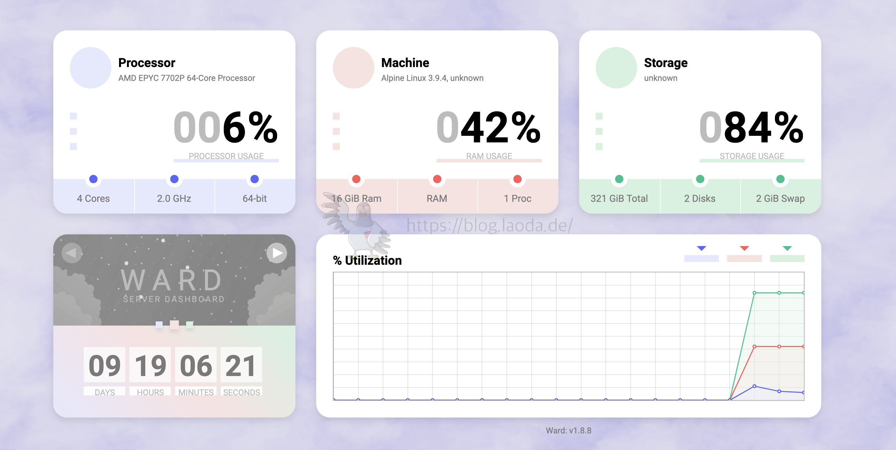

# docker app

## 常用命令

**容器操作**

```bash
# 更新启动方式
docker update --restart=unless-stopped <容器名称或ID>

# 查看 Docker 容器的重启策略（restart 方式）
docker inspect -f '{{.HostConfig.RestartPolicy.Name}}' <容器名称或ID>
```

**部署相关**

```bash
# 部署
docker compose up -d

# 更新
docker-compose down  #停止容器
docker-compose pull  #拉取新的docker镜像
docker-compose up -d  #启动容器
docker image prune  #删除旧的镜像文件

# 卸载
docker compose down

# 停止
docker compose stop

# 重启
docker compose restart

```

---

## 0.nginx-proxy-manager

**介绍**

该项目属于一个预构建的docker映像，它可以让你轻松地部署到你的网站上运行，包括免费的SSL，而不需要知道太多关于 Nginx 或 Let's Encrypt 的信息。

官网：https://nginxproxymanager.com/

项目地址：https://github.com/NginxProxyManager/nginx-proxy-manager

**部署**

docker-compose.yaml

```yaml
services:
  app:
    image: 'docker.io/jc21/nginx-proxy-manager:latest'
    restart: unless-stopped
    ports:
      - '80:80'
      - '81:81'
      - '443:443'
    volumes:
      - ./data:/data
      - ./letsencrypt:/etc/letsencrypt
```
登录 http://127.0.0.1:81

默认账户

```txt
Email:    admin@example.com
Password: changeme
```

**Proxy Hosts 代理服务**


**Redirection Hosts 重定向**


**Streams 端口转发**


**404 Hosts 错误页面**

Advanced 高级
Custom Nginx Configuration 自定义 Nginx 配置 

```html
location / {
  default_type text/html;
  add_header Content-Type "text/html; charset=utf-8";
  return 200 '<div align="center">
  <a href="https://weasontang.github.io">
    
  </a>
</div>';
}
```
---

## 1.ward
**简介**
Ward 是一个使用 Java 开发的简单而简约的服务器监控工具。Ward 支持自适应设计系统，它还支持深色主题，它只显示服务器的主要信息。Ward 在所有流行的操作系统上运行良好，因为它使用 OSHI。

项目地址：https://github.com/B-Software/Ward

效果如下：

**Docker搭建**
```zsh
sudo pacman -Syu ## 更新软件源

mkdir -p ~/data/docker_data/Ward  ## 在docker_data文件夹下创建Ward文件夹

cd ~/data/docker_data/Ward  ## 进入文件夹

git clone https://github.com/AntonyLeons/Ward.git   ## 在创建的文件夹下克隆项目并构建镜像
cd Ward 
docker build . --tag ward

```

运行
```zsh
docker run -d --name ward -p 4000:4000 \
-p 自定义端口号:自定义端口号 \
--privileged=true \
--restart always \
ward:latest

```

配置
```zsh
docker exec -it ward /bin/sh
nano setup.ini

docker stop ward
docker rm -f ward 

```
---

## 2.code server

```zsh
# 使用最后一行无需直接以下的拉取命令
docker pull codercom/code-server:4.0.1
docker pull codercom/code-server:latest

# 运行容器
sudo docker run -d -p 8080:8080 -v "${HOME}/.config/Code:/home/coder/.config" -v "${HOME}/workspace:/home/coder/project" -u "$(id -u):$(id -g)" -e "DOCKER_USER=$USER" codercom/code-server:latest


sudo docker ps
sudo docker logs <容器ID或名称>


# 进入容器获取密码
sudo docker exec -it <容器ID或名称> bash
cat .config/code-server/config.yaml


```
参数说明：
• -d 参数表示后台运行容器。
• -p 8080:8080 将容器内的 8080 端口映射到主机的8080端口。
• -v “${HOME}/.config:/home/coder/.config” 将主机上的 VS Code 配置目录挂载到容器内，这样你的配置和插件就可以持久化了。
• -v “${HOME}/workspace:/home/coder/project” 将当前工作目录挂载到容器内，以便在容器中编辑项目文件。
• -u “$(id -u):$(id -g)” 以当前用户的 UID 和 GID 运行容器，这可以避免权限问题。
• -e “DOCKER_USER=$USER” 设置环境变量 DOCKER_USER 为当前用户，有些镜像可能会用到这个

---

## 3.v2raya

```zsh
# docker命令启动

```bash
# 2.2.6.7
docker run -d \
--restart=unless-stopped \
--privileged \
--network=host \
--name v2raya \
-e V2RAYA_LOG_FILE=/tmp/v2raya.log \
-e V2RAYA_V2RAY_BIN=/usr/local/bin/v2ray \
-e V2RAYA_NFTABLES_SUPPORT=off \
-e IPTABLES_MODE=legacy \
-v ./etc/v2raya:/etc/v2raya \
mzz2017/v2raya
```
**docker-compose.yml**

```YAML
version: '3.8'

services:
  v2raya:
    image: mzz2017/v2raya
    container_name: v2raya
    restart: unless-stopped
    privileged: true
    network_mode: host
    environment:
      - V2RAYA_LOG_FILE=/tmp/v2raya.log
      - V2RAYA_V2RAY_BIN=/usr/local/bin/v2ray
      - V2RAYA_NFTABLES_SUPPORT=off
      - IPTABLES_MODE=legacy
    volumes:
      # - ./lib/modules:/lib/modules:ro
      - ./etc/v2raya:/etc/v2raya
```
**测试：返回 HTTP/2 200  则成功**
```bash
 curl -Is https://www.google.com.hk/ | head -n 1 
```

plane

```zsh
https://v2rayshare.com/
```
---

## 4.yesplaymusic

```bash
# 拉取镜像
docker pull  fogforest/yesplaymusic
junlongzzz/yesplaymusic

# 创建目录
mkdir -p $HOME/data/docker_data/yesplaymusic  && cd $HOME/data/docker_data/yesplaymusic 

# 更新启动方式
docker update --restart=unless-stopped YesPlayMusic
```

docker-compose.yaml
```yaml
version: '3'
services:
  YesPlayMusic:
    image: junlongzzz/yesplaymusic
    container_name: YesPlayMusic
    volumes:
      - /etc/localtime:/etc/localtime:ro
      # - /etc/timezone:/etc/timezone:ro
    ports:
      - 7950:80
    environment:
      - NODE_TLS_REJECT_UNAUTHORIZED=1
    restart: unless-stopped
```

## 5.kasmweb/chrome

```bash
docker run --rm -it --shm-size=512m -p 6901:6901 -e VNC_PW=password kasmweb/chromium:x86_64-1.15.0-rolling

b
User : kasm_user
Password: password
```
>The container is now accessible via a browser : https://IP_OF_SERVER:6901

---

## 6.mongodb

```zsh
# 拉去镜像
docker pull mongo

# 运行
docker run -d --restart=unless-stopped --name mongo -v $HOME/data/docker_data/mongodb/data:/data/db -p 27017:27017 mongo --serviceExecutor adaptive

```

docker-compose.yaml
```yaml
services:

  mongo:
    container_name: mongo
    image: mongo
    restart: unless-stopped
    environment:
      MONGO_INITDB_ROOT_USERNAME: root
      MONGO_INITDB_ROOT_PASSWORD: 54321
    volumes:
      - $HOME/data/docker_data/mongodb/data:/data/db
    ports:
      - 27017:27017
```

```bash
# 进入容器
# 如果MongoDB6.0及以上使用：
docker exec -it mongo /bin/mongosh
# 如果是6.0以下的版本使用：
docker exec -it mongo /bin/mongo 

# createUser之前先use admin切换一下
use admin

# 创建用户并赋予root权限
db.createUser(
	{
		user:"root",
		pwd:"123456",
		roles:[{role:"root",db:"admin"}]
	}
);
 
# 尝试使用上面创建的用户信息进行连接。
db.auth('root', '123456');

```
```bash
# 通过bash
docker exec -it mongodb bash
 
# 登录容器
mongosh admin -u root -p 123456     
# -u 后面的是创建容器指定的账号   
#-p 后面跟的是创建容器指定的密码
```

其他命令
```bash
# 更新用户角色，修改用户权限，不会覆盖原权限信息，只新增权限：
db.updateUser("admin",{roles:[{role:"readWrite",db:"admin"}]})
 
# 更新用户密码
db.changeUserPassword("admin","123456")
 
# 删除用户
db.dropUser({'admin'})
 
# 查看所有用户
show users
 
# 查看数据库（非admin数据库的用户不能使用数据库命令）
show dbs

```
---

## 7.vocechat

**官方简介：**
VoceChat 是一款超轻型 Rust 支持的聊天应用程序、API 和 SDK，优先考虑私人托管。使用 VoceChat 构建您自己的聊天功能！
具有机器人和社交渠道功能的私人托管聊天 SDK，可轻松集成到您的网站或应用程序

**docker-compose 部署**

```zsh
mkdir ~/VoceChat && cd VoceChat  #创建一个目录并进入此目录
touch docker-compose.yml  #创建一个yml文件
```

docker-compose.yml 

```YAML
services:
    ywsjchat:   #服务名，可以自定义
        container_name: weachat    #容器名，可以自定义
        ports:
            - '5656:3000'   # 冒号左边可以改成自己服务器未被占用的端口
        environment:
            - PUID=0    # 稍后在终端输入id可以查看当前用户的id
            - PGID=0    # 同上
            - TZ=Asia/Shanghai  #时区，可以自定义
        restart: unless-stopped    
        volumes:
           - './data:/home/vocechat-server/data' #冒号左侧可以更改本地的目录
        image: privoce/vocechat-server:latest    #镜像名不要改

```

部署运行

```zsh
# 部署
docker-compose up -d

# 后续更新
docker-compose down  #停止容器
docker-compose pull  #拉取新的docker镜像
docker-compose up -d  #启动容器
docker image prune  #删除旧的镜像文件
```
---

## 8.ddns-go

> 因为一般家庭或企业用户所获得的的广域网ip并非固定，而是会时常变化，一旦变化，我们的域名针对ip的A类解析记录就会失效，因此我们需要DDNS(动态域名解析服务)，在ip变动时自动更改我们的域名解析记录值。

ddns-go项目地址：

GitHub地址：https://github.com/jeessy2/ddns-go
Gitee地址：https://gitee.com/OtherCopy/ddns-go

**docker-compose.yml**

```YAML
services:
  ddns-go:
    image: jeessy/ddns-go
    restart: unless-stopped
    network_mode: "host"
    volumes:
      - ./ddns-go_data:/root
```

**部署相关**

```zsh
# 部署
docker compose up -d

# 更新
docker-compose down  #停止容器
docker-compose pull  #拉取新的docker镜像
docker-compose up -d  #启动容器
docker image prune  #删除旧的镜像文件

# 卸载
docker compose down

# 停止
docker compose stop

# 重启
docker compose restart

```

在浏览器中打开http://主机IP:9876，修改你的配置，成功

---

## 9.Easyimages

[github](https://github.com/icret/EasyImages2.0)

**docker-compose.yml**

```YAML
services:
  easyimage:
    image: ddsderek/easyimage:latest
    container_name: easyimage
    restart: unless-stopped
    ports:
      - "8778:80"                   # 左侧端口可自定义（如8080:80）
    environment:
      - TZ=Asia/Shanghai  # 设置时区为上海
      - PUID=1000  # 指定用户的 UID（用户 ID）
      - PGID=1000  # 指定用户的 GID（组 ID）
      - DEBUG=false  # 关闭调试模式
    volumes:
      - ./config:/app/web/config    # 挂载配置文件
      - ./i:/app/web/i              # 挂载图片存储目录
```
---

## 10.netdata

[github](https://github.com/netdata/netdata)

**docker-compose.yml**

```YAML
version: '3.8'

services:
  netdata:
    image: netdata/netdata
    container_name: netdata
    hostname: my-netdata # Optionally set a hostname for Netdata
    ports:
      - "19999:19999"
    cap_add:
      - SYS_PTRACE
      - SYS_ADMIN
    volumes:
      - ./netdataconfig:/etc/netdata
      - ./netdatalib:/var/lib/netdata
      - /proc:/host/proc:ro
      - /sys:/host/sys:ro
      - /var/run/docker.sock:/var/run/docker.sock:ro
    restart: unless-stopped

volumes:
  netdataconfig:
  netdatalib:
```
---

## 11.filecodebox

**介绍**

FileCodeBox 是一个基于 FastAPI + Vue3 开发的轻量级文件分享工具。它允许用户通过简单的方式分享文本和文件，接收者只需要一个提取码就可以取得文件，就像从快递柜取出快递一样简单。

[guthub](https://github.com/vastsa/FileCodeBox)

```YAML
services:
  file-code-box:
    image: lanol/filecodebox:latest
    volumes:
      - ./fcb-data:/app/data:rw
    restart: unless-stopped
    ports:
      - "12345:12345"
volumes:
  fcb-data:
    external: false
```

---

## 12.zfile

[官网](https://www.zfile.vip)

[docker安装](https://docs.zfile.vip/install/os-docker)


```YAML
version: '3.3'
services:
    zfile:
        container_name: zfile
        restart: unless-stopped
        ports:
            - '12456:8080'
        volumes:
            - './db:/root/.zfile-v4/db'
            - './logs:/root/.zfile-v4/logs'
            - './file:/data/file'
            - './application.properties:/root/application.properties'
        image: zhaojun1998/zfile:latest
```