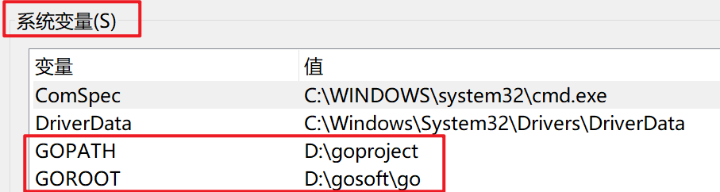
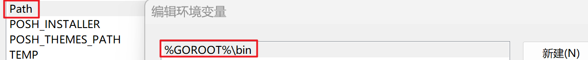

# go开发过程中遇到的问题

## 0.go安装和环境变量配置

### 下载
打开 Go [官方下载页面](https://golang.org/dl/)（若无法访问，可使用[国内镜像](https://studygolang.com/dl) ）。

### 环境变量配置

**系统环境变量**

```bash
GOROOT
```

```bash
GOPATH
```
**用户环境变量**

```bash
%GOROOT%\bin
```





### 其它配置

```bash
#启mod模式（项目管理需要用到）
go env -w GO111MODULE=on
#重新设置成七牛镜像源（推荐）或阿里镜像源（用原有的会比较慢）
go env -w GOPROXY=https://goproxy.cn,direct
go env -w GOPROXY=https://mirrors.aliyun.com/goproxy

#关闭包的MD5校验
go env -w GOSUMDB=off

#查看环境变量
go env

# 修改编译缓存路径（GOCACHE）
go env -w GOCACHE=D:\code\golang\cache

# 修改模块缓存路径（GOMODCACHE）
go env -w GOMODCACHE=D:\code\golang\pkg\mods
```

---


