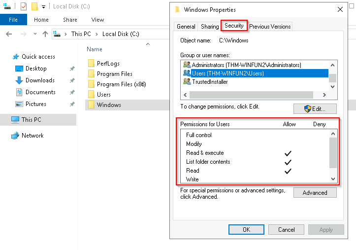
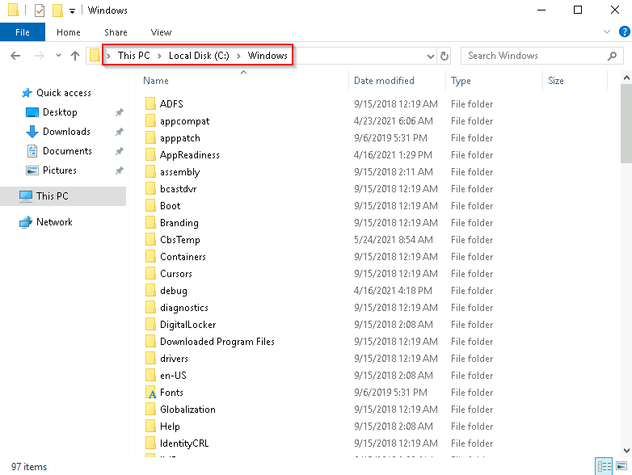
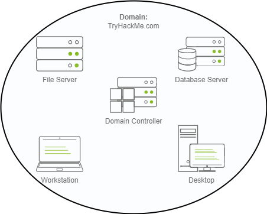
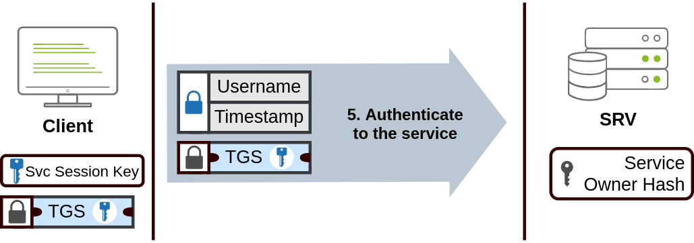
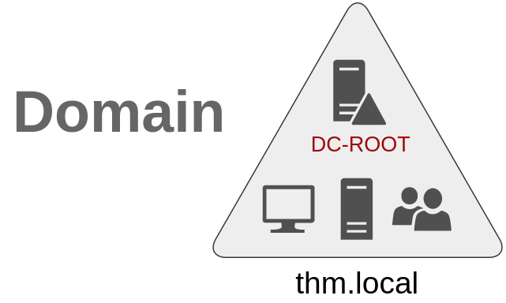
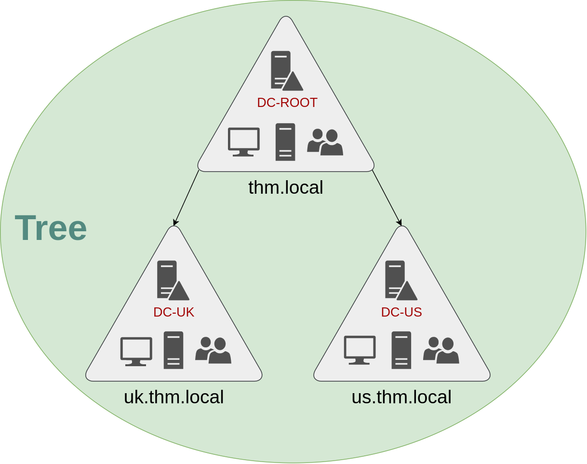
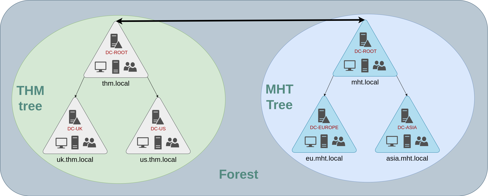

# Windwos Fundamentals

Get hands-on access to Windows and it's security controls. These basics will help you in identifying, exploiting and defending Windows.

Windows is the most popular operating system, used by both individuals and corporate environments all around the world. This module will get you comfortable using some of the key Windows features (in a safe environment), including user account permissions, resource management and monitoring, registry access and security controls.

## part 1

In part 1 of the Windows Fundamentals module, we'll start our journey learning about the Windows desktop, the NTFS file system, UAC, the Control Panel, and more..

### The Desktop (GUI)

The Windows Desktop, aka the graphical user interface or GUI in short, is the screen that welcomes you once you log into a Windows 10 machine.

### The File System

The file system used in modern versions of  Windows  is the **New Technology File System** or simply **[NTFS](https://learn.microsoft.com/en-us/windows-server/storage/file-server/ntfs-overview)** .

Before NTFS, there was  **FAT16/FAT32** (File Allocation Table) and **HPFS** (High Performance File System). 

You still see FAT partitions in use today. For example, you typically see FAT partitions in USB devices, MicroSD cards, etc.  but traditionally not on personal Windows computers/laptops or Windows servers.

NTFS is known as a journaling file system. In case of a failure, the file system can automatically repair the folders/files on disk using information stored in a log file. This function is not possible with FAT.   

NTFS addresses many of the limitations of the previous file systems; such as: 

- Supports files larger than 4GB
- Set specific permissions on folders and files
- Folder and file compression
- Encryption ( [Encryption File System](https://learn.microsoft.com/en-us/windows/win32/fileio/file-encryption) or EFS )

If you're running Windows, what is the file system your Windows installation is using? You can check the Properties (right-click) of the drive your operating system is installed on, typically the C drive (C:\).

You can read Microsoft's official documentation on FAT, HPFS, and NTFS [here](https://learn.microsoft.com/en-us/troubleshoot/windows-client/backup-and-storage/fat-hpfs-and-ntfs-file-systems) . 

Let's speak briefly on some features that are specific to NTFS. 

On NTFS volumes, you can set permissions that grant or deny access to files and folders.

The permissions are:

- Full control
- Modify
- Read & Execute
- List folder contents
- Read
- Write

The below image lists the meaning of each permission on how it applies to a file and a folder. (credit  [Microsoft](https://learn.microsoft.com/en-us/previous-versions/windows/it-pro/windows-2000-server/bb727008(v=technet.10)?redirectedfrom=MSDN) )

| Permission | Meaning for Folders | Meaning for Files |
|:---:|:---:|:---:|
| Read | Permits viewing and listing of files and subfolders | Permits viewing or accessing of the file's contents |
| Write | Permits adding of files and subfolders | Permits writing to a file |
| Read & Execute | Permits viewing and listing of files and subfolders as well as executing of files; inherited by files and folders | Permits viewing and accessing of the file's contents as well as executing of the file |
| List Folder Contents | Permits viewing and listing of files and subfolders as well as executing of files; inherited by folders only | N/A |
| Modify | Permits reading and writing of files and subfolders; allows deletion of the folder | Permits reading and writing of the file; allows deletion of the file |
| Full Control | Permits reading, writing, changing, and deleting of files and subfolders | Permits reading, writing, changing and deleting of the file | 

How can you view the permissions for a file or folder?

- Right-click the file or folder you want to check for permissions.
- From the context menu, select **Properties** .
- Within Properties, click on the **Security** tab.
- In the **Group or user names** list, select the user, computer, or group whose permissions you want to view.

In the below image, you can see the permissions for the **Users** group for the Windows folder. 

Refer to the Microsoft documentation to get a better understanding of the NTFS permissions for  Special Permissions .

Another feature of NTFS is **Alternate Data Streams ( ADS )**.

**Alternate Data Streams**  (ADS) is a file attribute specific to Windows  **NTFS**  (New Technology File System).

Every file has at least one data stream ( **$DATA** ), and ADS allows files to contain more than one stream of data. Natively [Window Explorer](https://support.microsoft.com/en-us/windows/file-explorer-in-windows-ef370130-1cca-9dc5-e0df-2f7416fe1cb1) doesn't display ADS to the user. There are 3rd party executables that can be used to view this data, but [Powershell](https://learn.microsoft.com/en-us/powershell/scripting/overview?view=powershell-7.5&viewFallbackFrom=powershell-7.1) gives you the ability to view ADS for files.

From a security perspective, malware writers have used ADS to hide data.

Not all its uses are malicious. For example, when you download a file from the Internet, there are identifiers written to ADS to identify that the file was downloaded from the Internet.

To learn more about ADS, refer to the following link from MalwareBytes [here](https://www.malwarebytes.com/blog/101/2015/07/introduction-to-alternate-data-streams) . 

Bonus : If you wish to interact hands-on with ADS, I suggest exploring Day 21 of  Advent of Cyber 2 .

### The Windows\System32 Folders

The Windows folder ( **C:\Windows** ) is traditionally known as the folder which contains the Windows operating system. 

The folder doesn't have to reside in the C drive necessarily. It can reside in any other drive and technically can reside in a different folder.

This is where environment variables, more specifically system environment variables, come into play.  Even though not discussed yet, the system  environment variable for the Windows directory is **%windir%**.

Per Microsoft , " Environment variables store information about the operating system environment. This information includes details such as the operating system path, the number of processors used by the operating system, and the location of temporary folders ".

There are many folders within the 'Windows' folder. See below.

One of the many folders is **System32** . 

The System32 folder holds the important files that are critical for the operating system.

You should proceed with extreme caution when interacting with this folder. Accidentally deleting any files or folders within System32 can render the Windows OS inoperational. Read more about this action [here](https://www.howtogeek.com/346997/what-is-the-system32-directory-and-why-you-shouldnt-delete-it) . 

**Operating System (OS)** is a layer between the hardware and the applications. From the application's perspective, the OS provides an interface to access the different hardware components, such as CPU, RAM, and disk storage. Examples of OS are Android, FreeBSD, Linux, macOS, and Windows.

**Note:** Many of the tools that will be covered in the Windows Fundamentals series reside within the System32 folder. 

### User Accounts, Profiles, and Permissions

User accounts can be one of two types on a typical local Windows system: **Administrator** & **Standard User**. 

The user account type will determine what actions the user can perform on that specific Windows system. 

- An Administrator can make changes to the system: add users, delete users, modify groups, modify settings on the system, etc. 
- A Standard User can only make changes to folders/files attributed to the user & can't perform system-level changes, such as install programs.

one way to access this information, and then some, is using Local User and Group Management. 

Right-click on the Start Menu and click Run. Type **lusrmgr.msc**.

Each group has permissions set to it, and users are assigned/added to groups by the Administrator. When a user is assigned to a group, the user inherits the permissions of that group. A user can be assigned to multiple groups.

**Note:** If you click on **Add someone else to this PC** from **Other users**, it will open **Local Users and Management.** 

### User Account Control

startup: win + R enter UserAccountControlSettings

The UAC settings can be changed or even turned off entirely (not recommended).

You can move the slider to see how the setting will change the UAC settings and Microsoft's stance on the setting.

The large majority of home users are logged into their Windows systems as local administrators. Remember any user with administrator as the account type can make changes to the system.

A user doesn't need to run with high (elevated) privileges on the system to run tasks that don't require such privileges, such as surfing the Internet, working on a Word document, etc. This elevated privilege increases the risk of system compromise because it makes it easier for malware to infect the system. Consequently, since the user account can make changes to the system, the malware would run in the context of the logged-in user.

To protect the local user with such privileges, Microsoft introduced **User Account Control (UAC)**. This concept was first introduced with the short-lived Windows Vista  and continued with versions of Windows that followed.

**User Account Control (UAC)** helps prevent malware from damaging a PC and helps organizations deploy a better-managed desktop. With UAC, apps and tasks always run in the security context of a non-administrator account, unless an administrator specifically authorizes administrator-level access to the system. UAC can block the automatic installation of unauthorized apps and prevent inadvertent changes to system settings.

**Note:** UAC (by default) doesn't apply for the built-in local administrator account. 

How does UAC work? When a user with an account type of administrator logs into a system, the current session doesn't run with elevated permissions. When an operation requiring higher-level privileges needs to execute, the user will be prompted to confirm if they permit the operation to run. 

### Settings and the Control Panel

On a Windows system, the primary locations to make changes are the Settings menu and the Control Panel.

win + R enter control

### Task Manager

The Task Manager provides information about the applications and processes currently running on the system. Other information is also available, such as how much CPU and RAM are being utilized, which falls under Performance. 

## part 2

In part 2 of the Windows Fundamentals module, discover more about System Configuration, UAC Settings, Resource Monitoring, the Windows Registry and more..

### System Configuration

The **System Configuration** utility (**MSConfig**) is for advanced troubleshooting, and its main purpose is to help diagnose startup issues. 

Reference the following document [here](https://learn.microsoft.com/en-us/troubleshoot/windows-client/performance/system-configuration-utility-troubleshoot-configuration-errors) for more information on the System Configuration utility. 

Start Menu: win + R enter msconfig

**Note:** You need local administrator rights to open this utility. 

### Change UAC Settings

We're continuing with Tools that are available through the **System Configuration** panel.

### Computer Management

**startup:** win + R enter compmgmt.msc

The Computer Management (**compmgmt**) utility has three primary sections: **System Tools, Storage**, and **Services and Applications**.

### System Information

**startup:** win + r enter msinfo32

What is the **System Information (msinfo32)** tool?

Per Microsoft, "Windows includes a tool called Microsoft System Information (Msinfo32.exe).  This tool gathers information about your computer and displays a comprehensive view of your hardware, system components, and software environment, which you can use to diagnose computer issues."

The  information in **System Summary** is divided into three sections:

- Hardware Resources
- Components
- Software Environment

System Summary will display general technical specifications for the computer, such as processor brand and model.

### Resource Monitor

**startup:** win + r enter resmon

What is Resource **Monitor (resmon)**?

> Per Microsoft, "Resource Monitor displays per-process and aggregate CPU, memory, disk, and network usage information, in addition to providing details about which processes are using individual file handles and modules. Advanced filtering allows users to isolate the data related to one or more processes (either applications or services), start, stop, pause, and resume services, and close unresponsive applications from the user interface. It also includes a process analysis feature that can help identify deadlocked processes and file locking conflicts so that the user can attempt to resolve the conflict instead of closing an application and potentially losing data."

In the Overview tab, Resmon has four sections:

- CPU
- Disk
- Network
- Memory

 ### Registry Editor

 🚀**startup:** win + r enter regedt32.exe

 The **Windows Registry** (per Microsoft) is a central hierarchical database used to store information necessary to configure the system for one or more users, applications, and hardware devices. 

 The registry contains information that Windows continually references during operation, such as:

- Profiles for each user
- Applications installed on the computer and the types of documents that each can create
- Property sheet settings for folders and application icons
- What hardware exists on the system
- The ports that are being used.

**Warning:** The registry is for advanced computer users. Making changes to the registry can affect normal computer operations. 

There are various ways to view/edit the registry. One way is to use the **Registry Editor (regedit)**.

Refer to the following Microsoft documentation [here](https://learn.microsoft.com/en-us/troubleshoot/windows-server/performance/windows-registry-advanced-users) to learn more about the Windows Registry. 

## part 3

In part 3 of the Windows Fundamentals module, learn about the built-in Microsoft tools that help keep the device secure, such as Windows Updates, Windows Security, BitLocker, and more...

### Windows Update

Updates are typically released on the 2nd Tuesday of each month. This day is called Patch Tuesday. That doesn't necessarily mean that a critical update/patch has to wait for the next Patch Tuesday to be released. If the update is urgent, then Microsoft will push the update via the Windows Update service to the Windows devices.

Refer to the following link to see the Microsoft Security Update Guide [here](https://msrc.microsoft.com/update-guide).  

Tip: Another way to access Windows Update is from the Run dialog box, or CMD, by running the command **control /name Microsoft.WindowsUpdate**.

### Windows Security

> Per Microsoft, "Windows Security is your home to manage the tools that protect your device and your data".

### Firewall & network protection

**What is a firewall?**

A security tool, hardware or software that is used to filter network traffic by stopping unauthorized incoming and outgoing traffic.

> Per Microsoft, "Traffic flows into and out of devices via what we call ports. A firewall is what controls what is - and more importantly isn't - allowed to pass through those ports. You can think of it like a security guard standing at the door, checking the ID of everything that tries to enter or exit".

**Note: Each network may have different status icons for you.**

What is the difference between the 3 (Domain, Private, and Public)?

> Per Microsoft, "Windows Firewall offers three firewall profiles: domain, private and public".

- **Domain** - The domain profile applies to networks where the host system can authenticate to a domain controller. 
- **Private** - The private profile is a user-assigned profile and is used to designate private or home networks.
- **Public** - The default profile is the public profile, used to designate public networks such as Wi-Fi hotspots at coffee shops, airports, and other locations.

Configuring the Windows Defender Firewall is for advanced Windows users. Refer to the following Microsoft documentation on best practices [here](https://learn.microsoft.com/en-us/windows/security/operating-system-security/network-security/windows-firewall/configure). 

Tip: Command to open the Windows Defender Firewall is **WF.msc**. 

### App & browser control

> Per Microsoft, "Microsoft Defender SmartScreen protects against phishing or malware websites and applications, and the downloading of potentially malicious files".

Refer to the official Microsoft document for more information on Microsoft Defender SmartScreen [here](https://feedback.smartscreen.microsoft.com/smartscreenfaq.aspx). 

**Check apps and files**

- Windows Defender SmartScreen helps protect your device by checking for unrecognized apps and files from the web. 

**Exploit protection**

- Exploit protection is built into Windows 10 (and, in our case, Windows Server 2019) to help protect your device against attacks. 

### Device security

Even though you'll probably never change any of these settings, for completion's sake, it will be covered briefly.

**Core isolation**

- **Memory Integrity** - Prevents attacks from inserting malicious code into high-security processes.

**Security processor**

Your security processor, called the trusted platform module (TPM), is providing additional encryption for your device.

What is the **Trusted Platform Module (TPM)**?

> Per Microsoft, "Trusted Platform Module (TPM) technology is designed to provide hardware-based, security-related functions. A TPM chip is a secure crypto-processor that is designed to carry out cryptographic operations. The chip includes multiple physical security mechanisms to make it tamper-resistant, and malicious software is unable to tamper with the security functions of the TPM".

### BitLocker

What is **BitLocker?**

> Per Microsoft, "BitLocker Drive Encryption is a data protection feature that integrates with the operating system and addresses the threats of data theft or exposure from lost, stolen, or inappropriately decommissioned computers".

On devices with TPM installed, BitLocker offers the best protection.

Per Microsoft, *"BitLocker provides the most protection when used with a Trusted Platform Module (TPM) version 1.2 or later. The TPM is a hardware component installed in many newer computers by the computer manufacturers. It works with BitLocker to help protect user data and to ensure that a computer has not been tampered with while the system was offline".*

Refer to the official Microsoft documentation to learn more about BitLocker [phere](https://learn.microsoft.com/en-us/windows/security/operating-system-security/data-protection/bitlocker/). 

### Volume Shadow Copy Service

Per [Microsoft](https://learn.microsoft.com/en-us/windows-server/storage/file-server/volume-shadow-copy-service), **the Volume Shadow Copy Service (VSS)** coordinates the required actions to create a consistent shadow copy (also known as a snapshot or a point-in-time copy) of the data that is to be backed up. 

Volume Shadow Copies are stored on the System Volume Information folder on each drive that has protection enabled.

If VSS is enabled (**System Protection** turned on), you can perform the following tasks from within **advanced system settings**. 

- Create a restore point
- Perform system restore
- Configure restore settings
- Delete restore points

From a security perspective, malware writers know of this Windows feature and write code in their malware to look for these files and delete them. Doing so makes it impossible to recover from a ransomware attack unless you have an offline/off-site backup

**end**

Note: Attackers use built-in Windows tools and utilities in an attempt to go undetected within the victim environment.  This tactic is known as Living Off The Land. Refer to the following resource [here](https://lolbas-project.github.io/) to learn more about this.

---

## Active Directory

Microsoft's Active Directory is the backbone of the corporate world. It simplifies the management of devices and users within a corporate environment. In this room, we'll take a deep dive into the essential components of Active Directory.

Objectives

- What Active Directory is
- What an Active Directory Domain is
- What components go into an Active Directory Domain
- Forests and Domain Trust
- And much more!

### Windows Domains

Picture yourself administering a small business network with only five computers and five employees. In such a tiny network, you will probably be able to configure each computer separately without a problem. You will manually log into each computer, create users for whoever will use them, and make specific configurations for each employee's accounts. If a user's computer stops working, you will probably go to their place and fix the computer on-site.

While this sounds like a very relaxed lifestyle, let's suppose your business suddenly grows and now has 157 computers and 320 different users located across four different offices. Would you still be able to manage each computer as a separate entity, manually configure policies for each of the users across the network and provide on-site support for everyone? The answer is most likely no.

To overcome these limitations, we can use a **Windows domain**. Simply put, a Windows domain is a group of users and computers under the administration of a given business. The main idea behind a domain is to centralise the administration of common components of a Windows computer network in a single repository called **Active Directory (AD)**. The server that runs the Active Directory services is known as a **Domain Controller (DC)**.

The main advantages of having a configured Windows domain are:

- **Centralised identity management:** All users across the network can be configured from Active Directory with minimum effort.
- **Managing security policies:** You can configure security policies directly from Active Directory and apply them to users and computers across the network as needed.

In school/university networks, you will often be provided with a username and password that you can use on any of the computers available on campus. Your credentials are valid for all machines because whenever you input them on a machine, it will forward the authentication process back to the **Active Directory**, where your credentials will be checked. Thanks to Active Directory, your credentials don't need to exist in each machine and are available throughout the network.

In a Windows domain, credentials are stored in a centralised repository called **Active Directory**

The server in charge of running the Active Directory services is called **Domain Controller**

### Active Directory

The core of any Windows Domain is the **Active Directory Domain Service (AD DS)**. This service acts as a catalogue that holds the information of all of the "objects" that exist on your network. Amongst the many objects supported by AD, we have users, groups, machines, printers, shares and many others. Let's look at some of them:

***Users***

Users are one of the most common object types in Active Directory. Users are one of the objects known as **security principals**, meaning that they can be authenticated by the domain and can be assigned privileges over **resources** like files or printers. You could say that a security principal is an object that can act upon resources in the network.

Users can be used to represent two types of entities:

- **People:** users will generally represent persons in your organisation that need to access the network, like employees.
- **Services:** you can also define users to be used by services like IIS or MSSQL. Every single service requires a user to run, but service users are different from regular users as they will only have the privileges needed to run their specific service.

***Machines***

Machines are another type of object within Active Directory; for every computer that joins the Active Directory domain, a machine object will be created. Machines are also considered "security principals" and are assigned an account just as any regular user. This account has somewhat limited rights within the domain itself.

The machine accounts themselves are local administrators on the assigned computer, they are generally not supposed to be accessed by anyone except the computer itself, but as with any other account, if you have the password, you can use it to log in.

**Note:** Machine Account passwords are automatically rotated out and are generally comprised of 120 random characters.

Identifying machine accounts is relatively easy. They follow a specific naming scheme. The machine account name is the computer's name followed by a dollar sign. For example, a machine named **DC01** will have a machine account called **DC01$**.

***Security Groups***

If you are familiar with Windows, you probably know that you can define user groups to assign access rights to files or other resources to entire groups instead of single users. This allows for better manageability as you can add users to an existing group, and they will automatically inherit all of the group's privileges. Security groups are also considered security principals and, therefore, can have privileges over resources on the network.

Groups can have both users and machines as members. If needed, groups can include other groups as well.

Several groups are created by default in a domain that can be used to grant specific privileges to users. As an example, here are some of the most important groups in a domain:

| Security Group | Description |
| :---: | :---: |
| Domain Admins | Users of this group have administrative privileges over the entire domain. By default, they can administer any computer on the domain, including the DCs. |
| Server Operators | Users in this group can administer Domain Controllers. They cannot change any administrative group memberships. |
| Backup Operators | Users in this group are allowed to access any file, ignoring their permissions. They are used to perform backups of data on computers. |
| Account Operators | Users in this group can create or modify other accounts in the domain. |
| Domain Users | Includes all existing user accounts in the domain. |
| Domain Computers | Includes all existing computers in the domain. |
| Domain Controllers | Includes all existing DCs on the domain. |

You can obtain the complete list of default security groups from the [Microsoft documentation](https://learn.microsoft.com/en-us/windows-server/identity/ad-ds/manage/understand-security-groups).

**Active Directory Users and Computers**

To configure users, groups or machines in Active Directory, we need to log in to the Domain Controller and run "Active Directory Users and Computers" from the start menu:

This will open up a window where you can see the hierarchy of users, computers and groups that exist in the domain. These objects are organised in **Organizational Units (OUs)** which are container objects that allow you to classify users and machines. OUs are mainly used to define sets of users with similar policing requirements. The people in the Sales department of your organisation are likely to have a different set of policies applied than the people in IT, for example. Keep in mind that a user can only be a part of a single OU at a time.

In Windows domains, Organizational Unit (OU) refers to containers that hold users, groups and computers to which similar policies should apply. In most cases, OUs will match departments in an enterprise.

You probably noticed already that there are other default containers apart from the THM OU. These containers are created by Windows automatically and contain the following:

- **Builtin:** Contains default groups available to any Windows host.
- **Computers:** Any machine joining the network will be put here by default. You can move them if needed.
- **Domain Controllers:** Default OU that contains the DCs in your network.
- **Users:** Default users and groups that apply to a domain-wide context.
- **Managed Service Accounts:** Holds accounts used by services in your Windows domain.

**Security Groups vs OUs**

You are probably wondering why we have both groups and OUs. While both are used to classify users and computers, their purposes are entirely different:

- **OUs** are handy for **applying policies** to users and computers, which include specific configurations that pertain to sets of users depending on their particular role in the enterprise. Remember, a user can only be a member of a single OU at a time, as it wouldn't make sense to try to apply two different sets of policies to a single user.
- **Security Groups**, on the other hand, are used to **grant permissions over resources**. For example, you will use groups if you want to allow some users to access a shared folder or network printer. A user can be a part of many groups, which is needed to grant access to multiple resources.

### Managing Users in AD 

Your first task as the new domain administrator is to check the existing AD OUs and users, as some recent changes have happened to the business. You have been given the following organisational chart and are expected to make changes to the AD to match it:

**Delegation **

One of the nice things you can do in AD is to give specific users some control over some OUs. This process is known as delegation and allows you to grant users specific privileges to perform advanced tasks on OUs without needing a Domain Administrator to step in.

One of the most common use cases for this is granting **IT support** the privileges to reset other low-privilege users' passwords. According to our organisational chart, Phillip is in charge of IT support, so we'd probably want to delegate the control of resetting passwords over the Sales, Marketing and Management OUs to him.

### Managing Computers in AD

By default, all the machines that join a domain (except for the DCs) will be put in the container called "Computers". If we check our DC, we will see that some devices are already there:

We can see some servers, some laptops and some PCs corresponding to the users in our network. Having all of our devices there is not the best idea since it's very likely that you want different policies for your servers and the machines that regular users use on a daily basis.

While there is no golden rule on how to organise your machines, an excellent starting point is segregating devices according to their use. In general, you'd expect to see devices divided into at least the three following categories:

1. Workstations

Workstations are one of the most common devices within an Active Directory domain. Each user in the domain will likely be logging into a workstation. This is the device they will use to do their work or normal browsing activities. These devices should never have a privileged user signed into them.

2. Servers  

Servers are the second most common device within an Active Directory domain. Servers are generally used to provide services to users or other servers. 

3. Domain Controllers

Domain Controllers are the third most common device within an Active Directory domain. Domain Controllers allow you to manage the Active Directory Domain. These devices are often deemed the most sensitive devices within the network as they contain hashed passwords for all user accounts within the environment.

### Group Policies

So far, we have organised users and computers in OUs just for the sake of it, but the main idea behind this is to be able to deploy different policies for each OU individually. That way, we can push different configurations and security baselines to users depending on their department.

Windows manages such policies through **Group Policy Objects (GPO)**. GPOs are simply a collection of settings that can be applied to OUs. GPOs can contain policies aimed at either users or computers, allowing you to set a baseline on specific machines and identities.

**Group Policy Object (GPO)** is a feature in Windows Server that allows administrators to control user and computer settings across the network. It provides a centralised way to manage and configure operating systems, applications, and user settings.

To configure GPOs, you can use the **Group Policy Management** tool, available from the start menu:

**GPO distribution**

GPOs are distributed to the network via a network share called **SYSVOL**, which is stored in the DC. All users in a domain should typically have access to this share over the network to sync their GPOs periodically. The SYSVOL share points by default to the **C:\Windows\SYSVOL\sysvol\\** directory on each of the DCs in our network.

### Authentication Methods  

When using Windows domains, all credentials are stored in the Domain Controllers. Whenever a user tries to authenticate to a service using domain credentials, the service will need to ask the Domain Controller to verify if they are correct. Two protocols can be used for network authentication in windows domains:

**- Kerberos:** Used by any recent version of Windows. This is the default protocol in any recent domain.

**- NetNTLM:** Legacy authentication protocol kept for compatibility purposes.

While NetNTLM should be considered obsolete, most networks will have both protocols enabled. Let's take a deeper look at how each of these protocols works.

**Kerberos Authentication**

Kerberos authentication is the default authentication protocol for any recent version of Windows. Users who log into a service using Kerberos will be assigned tickets. Think of tickets as proof of a previous authentication. Users with tickets can present them to a service to demonstrate they have already authenticated into the network before and are therefore enabled to use it.

Kerberos is a computer network authentication protocol that operates based on tickets, allowing nodes to securely prove their identity to one another over a non-secure network. It primarily aims at a client-server model and provides mutual authentication, where the user and the server verify each other's identity. The Kerberos protocol messages are protected against eavesdropping and replay attacks, and it builds on symmetric-key cryptography, requiring a trusted third party.

When Kerberos is used for authentication, the following process happens:

The user sends their username and a timestamp encrypted using a key derived from their password to the **Key Distribution Center (KDC)**, a service usually installed on the Domain Controller in charge of creating Kerberos tickets on the network.

The KDC will create and send back a **Ticket Granting Ticket (TGT)**, which will allow the user to request additional tickets to access specific services. The need for a ticket to get more tickets may sound a bit weird, but it allows users to request service tickets without passing their credentials every time they want to connect to a service. Along with the TGT, a **Session Key** is given to the user, which they will need to generate the following requests.

In Kerberos, a **Ticket Granting Ticket (TGT)** serves as a user's proof of authentication and allows a user to request service tickets from the KDC, which can then be used to connect to services across the network.

Notice the TGT is encrypted using the **krbtgt** account's password hash, and therefore the user can't access its contents. It is essential to know that the encrypted TGT includes a copy of the Session Key as part of its contents, and the KDC has no need to store the Session Key as it can recover a copy by decrypting the TGT if needed.

When a user wants to connect to a service on the network like a share, website or database, they will use their TGT to ask the KDC for a **Ticket Granting Service (TGS)**. TGS are tickets that allow connection only to the specific service they were created for. To request a TGS, the user will send their username and a timestamp encrypted using the Session Key, along with the TGT and a **Service Principal Name (SPN)**, which indicates the service and server name we intend to access.

As a result, the KDC will send us a TGS along with a **Service Session Key**, which we will need to authenticate to the service we want to access. The TGS is encrypted using a key derived from the **Service Owner Hash**. The Service Owner is the user or machine account that the service runs under. The TGS contains a copy of the Service Session Key on its encrypted contents so that the Service Owner can access it by decrypting the TGS.

The TGS can then be sent to the desired service to authenticate and establish a connection. The service will use its configured account's password hash to decrypt the TGS and validate the Service Session Key.

**NetNTLM Authentication**

NetNTLM works using a challenge-response mechanism. The entire process is as follows:

1. The client sends an authentication request to the server they want to access.
2. The server generates a random number and sends it as a challenge to the client.
3. The client combines their NTLM password hash with the challenge (and other known data) to generate a response to the challenge and sends it back to the server for verification.
4. The server forwards the challenge and the response to the Domain Controller for verification.
5. The domain controller uses the challenge to recalculate the response and compares it to the original response sent by the client. If they both match, the client is authenticated; otherwise, access is denied. The authentication result is sent back to the server.
6. The server forwards the authentication result to the client.
Note that the user's password (or hash) is never transmitted through the network for security.

**Note:** The described process applies when using a domain account. If a local account is used, the server can verify the response to the challenge itself without requiring interaction with the domain controller since it has the password hash stored locally on its SAM.

### Trees, Forests and Trusts

So far, we have discussed how to manage a single domain, the role of a Domain Controller and how it joins computers, servers and users.

As companies grow, so do their networks. Having a single domain for a company is good enough to start, but in time some additional needs might push you into having more than one.

**Trees**

Imagine, for example, that suddenly your company expands to a new country. The new country has different laws and regulations that require you to update your GPOs to comply. In addition, you now have IT people in both countries, and each IT team needs to manage the resources that correspond to each country without interfering with the other team. While you could create a complex OU structure and use delegations to achieve this, having a huge AD structure might be hard to manage and prone to human errors.

Luckily for us, Active Directory supports integrating multiple domains so that you can partition your network into units that can be managed independently. If you have two domains that share the same namespace (**thm.local** in our example), those domains can be joined into a **Tree**.

If our **thm.local** domain was split into two subdomains for UK and US branches, you could build a tree with a root domain of **thm.local** and two subdomains called **uk.thm.local** and **us.thm.local**, each with its AD, computers and users:

This partitioned structure gives us better control over who can access what in the domain. The IT people from the UK will have their own DC that manages the UK resources only. For example, a UK user would not be able to manage US users. In that way, the Domain Administrators of each branch will have complete control over their respective DCs, but not other branches' DCs. Policies can also be configured independently for each domain in the tree.

A new security group needs to be introduced when talking about trees and forests. The **Enterprise Admins** group will grant a user administrative privileges over all of an enterprise's domains. Each domain would still have its Domain Admins with administrator privileges over their single domains and the Enterprise Admins who can control everything in the enterprise.

**Forests**

The domains you manage can also be configured in different namespaces. Suppose your company continues growing and eventually acquires another company called **MHT Inc**. When both companies merge, you will probably have different domain trees for each company, each managed by its own IT department. The union of several trees with different namespaces into the same network is known as a **forest**.

**Trust Relationships**

Having multiple domains organised in trees and forest allows you to have a nice compartmentalised network in terms of management and resources. But at a certain point, a user at THM UK might need to access a shared file in one of MHT ASIA servers. For this to happen, domains arranged in trees and forests are joined together by **trust relationships**.

In simple terms, having a trust relationship between domains allows you to authorise a user from domain **THM UK** to access resources from domain **MHT EU**.

The simplest trust relationship that can be established is a **one-way trust relationship**. In a one-way trust, if **Domain AAA** trusts **Domain BBB**, this means that a user on BBB can be authorised to access resources on AAA:

The direction of the one-way trust relationship is contrary to that of the access direction.

**Two-way trust relationships** can also be made to allow both domains to mutually authorise users from the other. By default, joining several domains under a tree or a forest will form a two-way trust relationship.

It is important to note that having a trust relationship between domains doesn't automatically grant access to all resources on other domains. Once a trust relationship is established, you have the chance to authorise users across different domains, but it's up to you what is actually authorised or not.